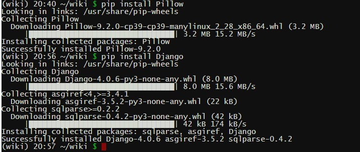

## Install Django and create a new project
1. Install Django  
`pip install Django`  

2. Create the new project with name "myproject"  
`django-admin startproject myproject`   
`cd myproject`
3. Start work with the project on the server http://127.0.0.1:8000/  
`python manage.py runserver`

4. Create apps in the project, for example one, with name "hello"  
`python manage.py startapp hello`

5. Install the application in `myproject/myproject/settings.py`. To do this, add the application name to the `INSTALLED_APPS` list:  
```python
# Application definition
INSTALLED_APPS = [
    'hello',
    'django.contrib.admin',
    'django.contrib.auth',
    'django.contrib.contenttypes',
    'django.contrib.sessions',
    'django.contrib.messages',
    'django.contrib.staticfiles',
]
```
## Configure the application
1. Go to `myproject\hello\views.py` and add http response cod 200 and our text  
```python
from django.http import HttpResponse
# Create your views here.
def index(request): 
    return HttpResponse("Hello, world!")
``` 

2. We already have the urls.py file for the whole project, but it's best to have separate files for each application.  Create a file with this path: `myproject\hello\urls.py` and add this to it:  
```python  
from django.urls import path
from . import views

urlpatterns = [
    path("", views.index, name="index")
]
```  

3. Include all paths from the `urls.py` file in our application. To do this, we will write: `include ("APP_NAME.urls")`, where `include` is a function that we access by importing `include` from `django.urls` as shown in `urls.py`  
```python  
from django.urls import path, include

urlpatterns = [
    path('admin/', admin.site.urls),
    path('hello/', include("hello.urls"))
]

```  
## Create [templates](https://docs.djangoproject.com/en/4.0/topics/templates/) to write HTML and CSS to separate files  

1. Create a file and path: `myproject\hello\templates\hello\index.html`  

2. Add the following code to the file:
```html
<!DOCTYPE html>
<html lang="en">
    <head>
        <title>Hello</title>
    </head>
    <body>
        <h1>Hello, World!</h1>
    </body>
</html>
```  
3. Add the following code to `myproject\hello\views.py`:
```python  
def index(request):
    return render(request, "hello/index.html")
```  
4. Change the contents of our HTML files depending on the URL visited using the `greet` function:  
```python 
def greet(request, name):
    return render(request, "hello/greet.html", {
        "name": name.capitalize()
    })
```  
5. Add the following code to `myproject\hello\templates\hello\greet.html`  
```html
<!DOCTYPE html>
<html lang="en">
    <head>
        <title>Hello</title>
    </head>
    <body>
        <h1>Hello, {{ name }}!</h1>
    </body>
</html>
```  
6. Add [datetime](https://docs.python.org/3/library/datetime.html) Python function
```  
> python
Python 3.10.2 (tags/v3.10.2:a58ebcc, Jan 17 2022, 14:12:15) [MSC v.1929 64 bit (AMD64)] on win32
Type "help", "copyright", "credits" or "license" for more information.
>>> import datetime
>>> now = datetime.datetime.now()
>>> now.day
11
>>> now.month
6
>>> now.year
2022
>>> exit()
```  
7. Add logic in `myproject\hello\views.py`:
```python 
import datetime
def index(request):
    now = datetime.datetime.now()
    return render(request, "hello/index.html", {
        "newyear": now.month == 1 and now.day == 1
    })
```  

8. Add conditions in html  
```html
    <body>
        
            <h1>YES</h1>
        
            <h1>NO</h1>
        
    </body>
```  

## Style templates
1. Add a static file and path `myproject\hello\static\hello\styles.css`
2. Add content in the file: 
```css
    h2 {
        color: red;
        font-family: sans-serif;
        font-size: 50px;
        text-align: center;
    }
```  
3. Add the code at the top of the html file  
```html  
{ % load static % }
```  
4. Add a css style sheet to the html file header  
`<link rel="stylesheet" href="{ % static 'hello/styles.css' % }">`

## Template extending (layout)
1. Create a base [template](https://tutorial.djangogirls.org/en/template_extending/): layout.html
```html
{ % load static % }
<!DOCTYPE html>
<html lang="en">
    <head>
        <title>Tasks</title>
        <link rel="stylesheet" href="{ % static 'tasks/styles.css' % }">
    </head>
    <body>
        { % block body % }
        { % endblock % }
    </body>
</html>
```  
2. Change in the files: `index.html` and `add.html`  
```html
{ % extends "tasks/layout.html" % }
{ % block body % }
    <h1>Tasks:</h1>
    <ul>
        
            <li>{{ task }}</li>
        
    </ul>
{ % endblock % }
```  
## Links
1. Add these links to the "index.html" and "add.html" files, respectively: 
```html
<a href="{ % url 'add' %}">Add a New Task</a>
<a href="{ % url 'index' %}">View Tasks</a>
```  
2. Function `url` find link in `myproject\tasks\urls.py`, but we have 'index' in an other application. That, we must add variable `app_name` in `urls.py` in each app. 

```python 
app_name = "tasks"
urlpatterns = [
    path("", views.index, name="index"),
    path("add", views.add, name="add"),
    path("wiki/<str:entry>/", views.page, name="page"),
]
```  
3. Change these links to the "index.html" and "add.html"
```html
<a href="{ % url 'tasks:add' %}">Add a New Task</a>
<a href="{ % url 'tasks:index' %}">View Tasks</a>

<!-- https://docs.djangoproject.com/en/4.0/ref/templates/builtins/#std-templatetag-url -->
{ % for entry in entries %}
<li><a href="{ % url 'encyclopedia:page' entry %}"> {{ entry }}</a></li> 
{ % endfor %}

```  

## Forms
1. Forward to `add` URL and use `post` method 
```html
<form action="{ % url 'tasks:add' %}" method="post">
```  
2. Cross-site request forgery [(CSRF)](https://portswigger.net/web-security/csrf) This CSRF check is built into the [Django Middleware framework](https://docs.djangoproject.com/en/4.0/topics/http/middleware/)

3. To include this technology in our code, we need to add a line to our form in `add.html`  
```html
<form action="{ % url 'tasks:add' %}" method="post">
            { % csrf_token %}
            <input type="text", name="task">
            <input type="submit">
        </form>
```  

## Django forms
1. To use the method we will study the documentation of the [Django forms](https://docs.djangoproject.com/en/4.0/ref/forms/api/) 
2. We import the forms module, for which we add the following at the beginning of `views.py`:  
```python   
from django import forms
```  
3. Now we can create a new form in `views.py`, creating a Python class called `NewTaskForm`:
```python   
class NewTaskForm(forms.Form):
    task = forms.CharField(label="New Task")
```  
- forms.Form [Python Inheritance](https://www.w3schools.com/python/python_inheritance.asp)
- forms.CharField [Built-in Field classes](https://docs.djangoproject.com/en/4.0/ref/forms/fields/#built-in-field-classes)
- label [Core field arguments](https://docs.djangoproject.com/en/4.0/ref/forms/fields/#core-field-arguments)

4. Now we can create a new form in views.py, creating a Python class called NewTaskForm:
```python 
# def add(request):
#     return render(request, "tasks/add.html")

def add(request):
    return render(request, "tasks/add.html", {
        "form": NewTaskForm()
    })
```  
5. In add.html change the input field to the form we just created:
```html 
        <form action="{ % url 'tasks:add' %}" method="post">
            { % csrf_token %}
            {{ form }}
<!--         <input type="text",name="task">   -->
            <input type="submit">
```  
6. Change `class` in views.py for add new filds to the form:  
```python 
class NewTaskForm(forms.Form):
    task = forms.CharField(label="New Task")
    priority = forms.IntegerField(label="Priority", min_value=1,max_value=10)
```  
- [Client-side form validation](https://developer.mozilla.org/en-US/docs/Learn/Forms/Form_validation)

7. Add a condition based on the `request` argument passed to our function:
```python
def add(request):
    # Перевіряємо, чи метод є методом POST
    if request.method == "POST":
        # Отримуємо дані, відправлені користувачем, і зберігаємо їх у вигляді форми
        form = NewTaskForm(request.POST)
        # Перевіряємо, чи дані форми дійсні (зі сторони сервера) 
        if form.is_valid():
            # Відділяємо завдання від «очищеної» версії даних форми 
            task = form.cleaned_data["task"]
            # Додаємо нове завдання до нашого списку завдань 
            tasks.append(task)
            # Перенаправлюємо користувача до списку завдань
            return HttpResponseRedirect(reverse("tasks:index"))
        else:
            # Якщо форма недійсна, повторно візуалізуємо сторінку з наявною інформацією.
            return render(request, "tasks/add.html", {
                "form": form
            })
    return render(request, "tasks/add.html", {
        "form": NewTaskForm()
    })
```  
8. To redirect the user after a successful submission, we need a few more imports:  
```python
from django.urls import reverse
from django.http import HttpResponseRedirect
```  
## Sessions
1. How to use [sessions](https://docs.djangoproject.com/en/4.0/topics/http/sessions/)

2. Let's delete the global variable `tasks`, we replaced it with `request.session ["tasks"]`  
```python
# tasks = ["foo", "bar", "baz"]
```  

3. Let's check if the "task" key already exists in our session
```python
def index(request):
    # Перевіряємо, чи ключ «task» вже існує у нашій сесії
    if "tasks" not in request.session:
        # Якщо ні, створюємо новий список
        request.session["tasks"] = []
    return render(request, "tasks/index.html", {
        "tasks": request.session["tasks"]
    })
```  
4. Add a new task:
```python
    # Додаємо нове завдання до нашого списку завдань 
    # tasks.append(task)
    request.session["tasks"] += [task]
```  

5. Error "no such table: django_session". With the command that allows you to save sessions in tables, we migrate standard Django tables to the database
```python
python manage.py migrate
```  

## Python environment deployment

1. Register on the [site pythonanywhere](https://www.pythonanywhere.com/)  
2. Open console and input the command where `wiki` - it is the project name:  
  `virtualenv -p /usr/bin/python3.9 wiki_env`    
3. Go to the project dir and activate it:  
  `source bin/activate`  

   

4. From a console with an active environment, run the following commands:  
```
pip install Pillow
pip install Django
```  


5. Open "File" menu in Pythonanywhere interface and upload in the home directory your project zip file   

6. Go to "Console" and `unzip wiki.zip`  

7. Open "Web" menu in Pythonanywhere interface and press "Add a new web app"  

8. More read on this [site](https://anhel.in/python/doc/django-deployment/)   


## [Go back](../README.md)

