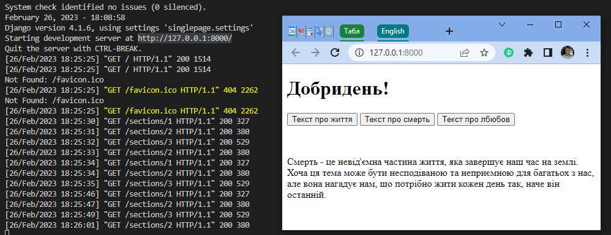
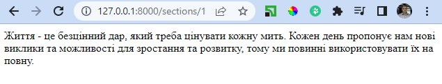

# Інструменти для створення користувацького інтерфейсу  
## Маніпулювання DOM елементами за допомогою JavaScript:      
1. В [прикладі](singlepage.html) кожний елемент буде зображено в окремому блоці `<div>`  
2. По-перше приховаємо всі елементи `<div>`  за допомогою `CSS`:  
```css
div {
    display: none;
}
```   
3. Тепер на html сторінці створимо `dataset` для кожної кнопки:
```html 
<button data-page="page1">Перша сторінка</button>
```
4. Додамо текст кожного блоку `<div>` (сторінки) які потім за потреби по черзі будемо відкривати функцією showPage:  
```js
function showPage(page) {
    // Показати div, переданий у аргументі функції
    document.querySelector(`#${page}`).style.display = 'block';
}
```
5. Обробляти натискання на кнопки, та викликати згадану функцію теж буде JS:  
```js
    // Обрати всі кнопки
    document.querySelectorAll('button').forEach(button => {
        // Коли кнопку натиснуто, викликати функцію показу блоку з обраним id 
        button.onclick = function() {
            showPage(this.dataset.page);
        }
    })
``` 
## Маніпулювання елементами DOM за допомогою AJAX
1. Зробимо застосунок Django з назвою `singlepage`  

  

2. Отже в застосунку у нас є три сторінки з різними URL-адресами нашталт http://127.0.0.1:8000/sections/1 що містять тільки тексти.  

  

3. Основна сторінка проекту [index.html](singlepage\singlepage\templates\singlepage\index.html) буди містити код з кнопками функціонально схожий на код з першого прикладу, але основна функція в ній `showSection(section)` буде маніпулювати не видимістю блоків дів, а буде зчитувати тексти з відповідних кнопкам URL-адрес.   

4. Отже все окрім завантаженого тексту на сторінці не змінюється, але URL-адреса теж залишається не змінною, хоча це було б корисно для швидкої навігації та прямого переходу до потрібного контенту.  

## Історія змін та прямий доступ до контенту сторінки за URL-адресою.
1. Тут на допомогу нам новий інструмент [History API](https://developer.mozilla.org/en-US/docs/Web/API/History_API) у JavaScript.  
2. Додамо в [застосунок](singlepage2\singlepage\templates\singlepage\index.html) код API що дозволить використовувати історію:  

```js
window.onpopstate = function(event) {
    console.log(event.state.section);
    showSection(event.state.section);
}

//Додати поточний стан до історії за допомогою наступної функції з трьома аргументами 
        history.pushState({section: section}, "", `section${section}`);
        showSection(section); 
```  
3. Таким чином ми отримаємо пряму адресу для доступу до контенту http://127.0.0.1:8000/section3 , та історію переходів між сторінками.


## Об'єкт window та прокрутка
Об'єкт `window` відрізняється від `document` тим що він відповідає за ту частину багатосторінкового документа яку ми бачимо на екрані, та має наступні властивості:    
- `window.innerWidth:` ширина вікна в пікселях.
- `window.innerHeight:` висота вікна в пікселях.  
- `window.scrollY:` скільки пікселів ми прокрутили від верхньої частини сторінки.
- `document.body.offsetHeight:` висота всього документа в пікселях.
- `window.scrollY + window.innerHeight >= document.body.offsetHeight` - чи прокрутив користувач до кінця сторінки.
Наступний js-код демонструє як працює функція прокрутки до кінця вікна:  
```js
// Слухач події прокручування
window.onscroll = () => {
    // Перевірити, чи ми внизу сторінки
    if (window.innerHeight + window.scrollY >= document.body.offsetHeight) {
        // Змінити колір фону на червоний
        document.querySelector('body').style.background = 'red';
    } else {
        // Змінити колір фону на зелений
        document.querySelector('body').style.background = 'green';
    }
};
``` 

На практиці цю властивість часто використовують для реалізації безкінечної прокрутки:
- за вищенаведеним механізмом дізнаємось чи дійшов користувач до кінця сторінки
- використовуючи js додаємо додатковий зміст

Отже створимо [застосунок Django](posts\posts\views.py) який генеруватиме нам потрібну кількість тестових постів форуму наприклад.  
Після запуску застосунку та вказавши в якості url: `http://127.0.0.1:8000/posts?start=10&end=20` отримаємо наступну відповідь у форматі JSON:  
```JSON
{"posts": ["Post#10", "Post#11", "Post#12", "Post#13", "Post#14", "Post#15", "Post#16", "Post#17", "Post#18", "Post#19", "Post#20"]}
```
Тепер створимо основну сторінку сайту [index.html](posts\posts\templates\scroll\index.html), яка буде містити порожній елемент DIV, що буде заповнюватись кодом JS в залежності від положення вікна у документі.

На початку коду html-сторінки ми вказуємо місце знаходження [файлу JavaScript](posts\posts\static\posts\script.js) у нашій теці static, та додаємо його туди. Нижче як раз та частина коду, яка вираховує кінець документу, та довантажує новий контент, роблячи сторінку нескінченою:   
```js
// Якщо користувач дійшов кінця сторінки, завантажити наступні 20 дописів
window.onscroll = () => {
    if (window.innerHeight + window.scrollY >= document.body.offsetHeight) {
        load();
    }
};
```

## Анімація за допомогою CSS  
Для створення анімації в файлі CSS використовують один з варіантів:  
- вказуючи стилі на початку та на закінченні анімації (to та from)  
```css
@keyframes animation_name {
    from {  /* Якісь стилі для початку */}
    to {/* Якісь стилі для завершення */}
}
```
- вказуючи стилі на різних етапах тривалості анімації (від 0% до 100%)
```css
@keyframes animation_name {
    0% { /* Якісь стилі для початку */ }
    75% {/* Якісь стилі після 3/4 анімації */}
    100% { /* Якісь стилі для завершення */}
}
```
Для застосування анімації до елемента описуємо в [його властивостях](https://www.w3schools.com/cssref/css3_pr_animation.php):  
- `animation-name` ім'я анімації
- `animation-duration` тривалість анімації (у секундах)
- `animation-iteration-count` кількість повторювань анімації (`infinite` для нескінченної анімації)
- `animation-fill-mode` режим заповнення анімації:
    * `none` - стилі не будуть застосовані до елемента
    * `forwards` - по завершенню анімація елемент збереже стилі останнього ключового кадру
    * `backwards` - по завершенню анімація елемент збереже стилі першого ключового кадру
    * `both` - по завершенню анімація елемент збереже стилі першого та останнього ключових кадрів

Докладніше дивіться у наступних прикладах кода:
- [збільшення розміру тексту](animate.html).
- [положення тексту на сторінці](animate1.html).
- [збільшення розміру тексту а потім зменшення і так до нескінченності](animate2.html).
- [останній фрагмент коду з додаванням JavaScript для керування анімацією](animate3.html).  

**Спробуємо використати отриманні знання для удосконалення раніше створеного проекту Django:**  
- додамо у [файлі скрипту](posts2\posts\static\posts\script.js) кнопку в функцію `add_post`, що генерує дописи:
```js
post.innerHTML = `${contents} <button class="hide">Приховати</button>`;
``` 
- тепер потрібно зробити обробник подій при натисканні на додану кнопку. Тут будемо використовувати клас parentElement, щоб знайти батьківський елемент цього елемента в DOM.:  
```js
document.addEventListener('click', event => {
    const element = event.target; // Знайти, що було натиснуто
    if (element.className === 'hide') {  
        element.parentElement.remove()
    }
});
```
- на цьому етапі наче все працює, але дописи зникають мит'єво, та користувач може не зрозуміти що змінюється на сторінці, тому тут самий час використати анімацію. 
- додамо в [CSS-файл](posts2\posts\static\posts\styles.css)  `@keyframes`, що описує анімацію, яка складається з двох частин: в першій змінює прозорість елементу DIV, а в другій його висоту, змушуючи поступово зникати.
- тепер ми маємо доповнити обробник натискання на кнопку так щоб мін запускав анімацію, що ми призупинили раніше:  
```js
element.parentElement.style.animationPlayState = 'running';
``` 
- також потрібно буде дочекатись завершення анімації, а лише потім видаляти відповідний натиснутій кнопці елемент, для чого додаємо ще одного слухача подій `animationend`:   
```js
element.parentElement.addEventListener('animationend', () => {
    element.parentElement.remove()   
})
``` 
## React

