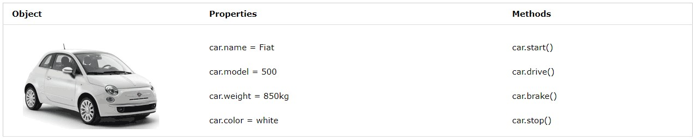
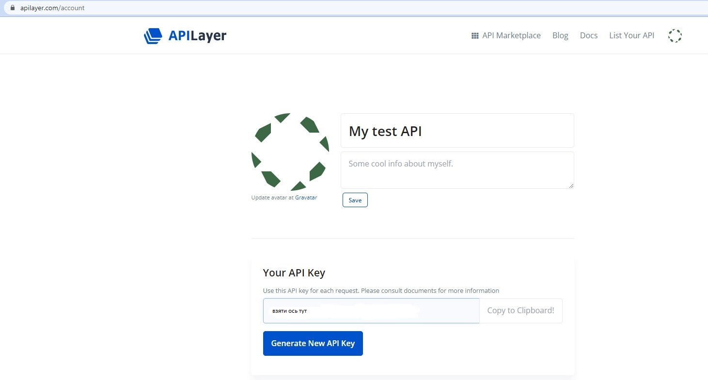
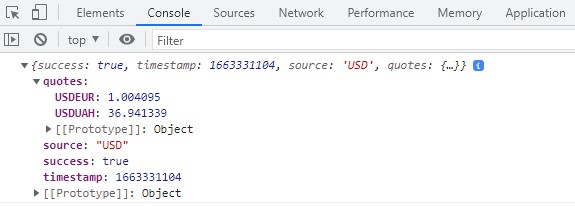
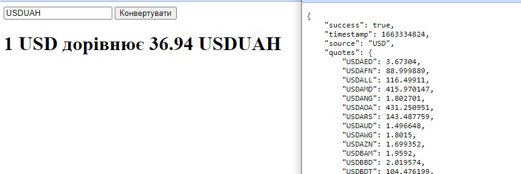
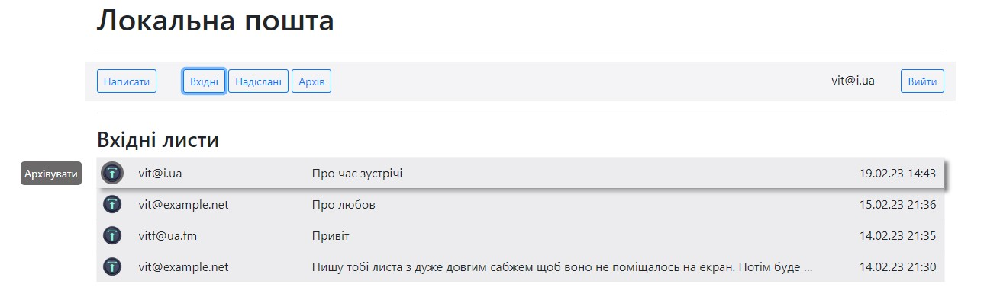
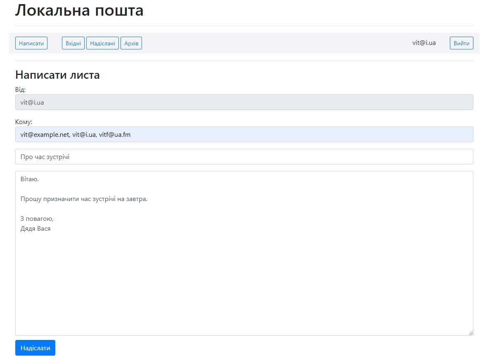
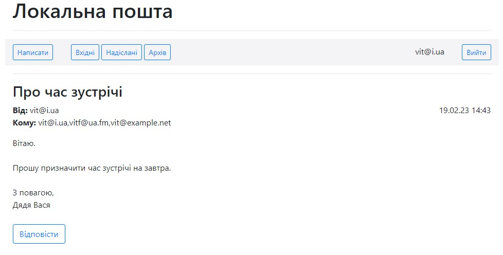

# JavaScript

## Теги додавання JavaScript до коду сторінки   
```html
<!DOCTYPE html>
<html lang="en">
    <head>
        <title>Привіт</title>
        <script>
            alert('Привіт, світ!');
        </script>
    </head>
    <body>
        <h1>Hello!</h1>
    </body>
</html>
```
## Події. Подійно-орієнтоване програмування.
Будь яка дія зроблена користувачем на сайті може оброблятися кодом як окрема подія. Реакцію на ту чи іншу подію зручно обробляти функціями написаними на [JavaScript](https://www.w3schools.com/js/default.asp).  
1. От же перетворимо наше сповіщення на сайті в окрему функцію:    
```html
function hello() {
    alert('Привіт, світ!')
}
```
2. Наступним рядком описуємо HTML-кнопку з атрибутом `onclick`, який дає вказівки браузеру викликати нашу функцію при натисканні на неї:  
```html
<button onclick="hello()">Click Here</button>
```
3. Код сторінки буде виглядати тепер наступним чином:  
```html
<!DOCTYPE html>
<html lang="en">
    <head>
        <title>Привіт</title>
        <script>
            function hello() {
                alert('Привіт, світ!');
            }
        </script>
    </head>
    <body>
        <h1>Hello!</h1>
        <button onclick="hello()">Click Here</button>
    </body>
</html>
```
## Змінні.
1. Є три ключові слова, які ми можемо використовувати для присвоєння значень у JavaScript:  
- `var` - використовується для глобального визначення змінної: `var age = 20;`  
- `let` - використовується для визначення змінної, область видимості якої обмежена поточним блоком, таким як функція або цикл: `let counter = 1;`  
- `const` - використовується для визначення значення, яке не зміниться: `const PI = 3.14;`  

2. Для виводу змінної проміж тексту використовуємо [шаблонні літерали](https://developer.mozilla.org/en-US/docs/Web/JavaScript/Reference/Template_literals) з наступним синтаксисом `` `Text ${var}` ``  

3. Для прикладу того, як ми можемо використовувати змінні, розробимо простий лічильник:  

```html
<!DOCTYPE html>
<html lang="uk">
    <head>
        <title>Обрахунок</title>
        <script>
            let counter = 0;
            function count() {
                counter++;
                alert(counter);
            }
        </script>
    </head>
    <body>
        <h1>Привіт!</h1>
        <button onclick="count()">Порахувати</button>
    </body>
</html>
```
## querySelector  
1. Функція `document.querySelector` та повертає елементи DOM. Треба звернути увагу, що функція повертає лише перший знайдений елемент моделі DOM, в нашому випадку це тег `h1`:    
`let heading = document.querySelector('h1');`  

2. Щоб маніпулювати елементом, який ми щойно знайшли, ми можемо змінити його властивість `innerHTML` (зміст тегу):
```html
heading.innerHTML = ' До побачення!';
```
3. В коді сторінки ми також можемо використовувати умовні оператори [if, else, and else if](https://www.w3schools.com/js/js_if_else.asp)

4.  в JavaScript ми використовуємо оператор `===` як жорсткіше порівняння між двома елементами, яке також перевіряє, чи належать об’єкти до одного типу. 

5. Напишемо функцію, яка заміню заголовок H1 нашої сторінки:
```html
<!DOCTYPE html>
<html lang="en">
    <head>
        <title>Обрахунок</title>
        <script>
            function hello() {
                const header = document.querySelector('h1');
                if (header.innerHTML === 'Привіт!') {
                    header.innerHTML = 'До побачення!';
                }
                else {
                    header.innerHTML = 'Привіт!';
                }
            }
        </script>
    </head>
    <body>
        <h1>Привіт!</h1>
        <button onclick="hello()">Натисніть тут</button>
    </body>
</html>
```

## Відокремлення коду JS від HTML
1. Спочатку в [файлі](counter01.html) позбудемося від рядкового коду JavaScript. Так само, як ми звикли робити з CSS, додавши рядок коду, який змінює атрибут `onclick` кнопки на сторінці, і видаливши атрибут `onclick` з тегу `button`:  

`document.querySelector('button').onclick = count;`  
Зверніть увагу, що ми не викликаємо функцію count, додаючи дужки, а просто називаємо функцію.  

2. Однак, у консолі нашого браузера бачимо помилку у рядку 6:   
``` 
counter01.html:6 Uncaught TypeError: Cannot set properties of null (setting 'onclick')
    at counter01.html:6:54
(anonymous) @ counter01.html:6
```
Ця помилка пов'язана з тим, що доданий код відпрацьовує раніше ніж завантажилась сторінка, таким чином він не знаходить на сторінці тегу 'button'. Позбутися цієї помилки легко, перемістивши код JavaScript в те місце HTML коду сторінки, де вона вже буде повністю завантажена, або завантажений потрібний елемент DOM, але це буде не універсальне рішення.  

3. Отже, щоб виправити цю помилку існує функція [addEventListener](https://www.w3schools.com/jsref/met_document_addeventlistener.asp), яка вкаже, щоб код запускатиметься лише після повного завантаження сторінки. Ця функція приймає два аргументи:  
- Подія для прослуховування (наприклад: 'click', але ми в прикладі нижче будемо слухати подію 'DOMContentLoaded', що виникає коли весь контент сторінки буде завантажено)  
- Функція, яка запускається при настанні події (наприклад: count, але ми використовуємо замість назви функції конструкцію `function() {}`, що дозволяє підставити в цей аргумент відразу код анонімної функції назва якої нас не цікавить, бо ми до неї з інших міць не плануємо більше звертатись)  

Ми можемо використовувати цю функцію, щоб запустити код лише після завантаження всього вмісту:  

```js
document.addEventListener('DOMContentLoaded', function() {
    document.querySelector('button').onclick = count;
});
```
Тут треба зауважити, що другий рядок можна представити цією ж функцією, яка буде слухати подію 'click', ось таким чином:  

```js
document.querySelector('button').addEventListener('click', count);
```
У наведеному прикладі ми використали анонімну функцію, якій ніколи не присвоюється ім’я. Помилка зникла, код запрацював. Вихідний код у [файлі](counter01.html).  


4. Перемістимо JavaScript в окремий файл [counter02.js](counter02.js) а HTML-код залишимо у файлі [counter02.html](counter02.html) для чого:  
- Скопіюємо увесь код JavaScript в окремий файл, який закінчується на .js
- Додамо атрибут src до тегу <`script`>, який вказує на цей новий файл.  

5. Переваги відокремлення JavaScript - коду в окремий файл:  
- Візуальна привабливість: наші окремі файли HTML і JavaScript стають більш читабельними.
- Доступ з різних файлів HTML: тепер у нас може бути кілька файлів HTML, які мають однаковий JavaScript.
- Співпраця: тепер ми можемо легко запропонувати одній людині працювати над JavaScript, а іншій – над HTML.
- Імпорт: ми можемо імпортувати бібліотеки JavaScript, які вже написали інші люди. Наприклад, `Bootstrap` має власну бібліотеку JavaScript

## Робота з формами
1. Зробимо найпростішу форму, де користувач може ввести своє ім’я, щоб отримати персоніфіковане привітання. Відразу розносимо код на два файли:  
- [form.js](form.js)  
- [form.html](form.html)  

2. Деякі примітки щодо створеної сторінки:  
- Атрибут `autofocus` для поля `name`, щоб вказати, що курсор повинен бути встановлений всередині цього поля, щойно сторінка завантажується.
- `#name` всередині `document.querySelector`, щоб знайти елемент з id of name. У цій функції ми можемо використовувати ті самі селектори, що й у CSS.
- Атрибут `value` поля введення, щоб знайти те, що зараз введено.

3. Обрати окремий елемент з HTML-коду так само як і в CSS можливо отримати за допомогою функції querySelector:  

- document.querySelector('tag')
- document.querySelector('#id')
- document.querySelector('.class')  

## Зміна CSS за допомогою JS та робота з масивом елементів
1. У файлі [colors.html](colors.html) напишемо код простої форми з кнопками, що мають змінювати колір заголовка сторінки.

2. Тепер в розділі скриптів використовуємо функцію  `querySelectorAll`, щоб зібрати усі зазначені в дужках елементи (кнопки) в [список вузлів](https://www.w3schools.com/js/js_htmldom_nodelist.asp), який можна буде обробити так само як [масив](https://www.w3schools.com/js/js_arrays.asp):  


```js
document.querySelectorAll('button').forEach(function(button)
```

3. Використав функцію [forEach](https://www.w3schools.com/jsref/jsref_foreach.asp), яка приймає аргументом в JavaScript іншу функцію і застосовує цю функцію до кожного елемента в списку або масиві.

4. Змінюємо CSS об'єкт за допомогою атрибута `style.SOMETHING` (в нашому випадку style.color):  

```js
document.querySelector("#hello").style.color = button.dataset.color;
```

5. Ми використовуємо атрибут `data-SOMETHING` (в нашому випадку `data-color`) замість `id` для призначення даних елементу HTML, щоб використовуючи властивість dataset елемента в скриптах:

```js
document.querySelector("#hello").style.color = button.dataset.color; 
```  
Атрибути даних завжди починаються зі слова `data` після якого ставиться `-`, після якого вказується ім'я інформації, яку потрібно зберегти про елемент HTML. В даному випадку зберігаємо дані про те на який колір потрібно змінити текст при натисканні кнопки.  

## Консоль JavaScript
1. Консоль, яку можна знайти в інструментах розробника у своєму браузері, натиснувши на вкладку `console` – це корисний інструмент для тестування невеликих фрагментів коду, який дозволяє:
 - запускати код JavaScript в консолі
 - змінювати значення змінних
 - дебагінг з виведенням в консоль дій користувача на сторінці

 2. Додамо до сторінки `colors.html` такий рядок:  

```js
console.log(document.querySelectorAll('button'));
```
## Обробка випадного меню та стрілкові функції 
1. Продовжимо оптимізацію кода за допомогою [стрілкових функцій](https://www.w3schools.com/js/js_arrow_function.asp) у файлі [colors01.html](colors01.html)  

2. Анонімну функцію `function()` змінимо на стрілковий еквівалент `=>` 

3. Анонімну функцію з аргументом `forEach(function(button) {` змінимо на стрілковий еквівалент `forEach(button => {`   

4. Іменовані функції, які використовують стрілки, на прикладі `function count() {` записується як `coutn = () => {`  

5. Заміняємо кнопки в коді HTML на випадне меню:  

```html
<select>
    <option value="black">Чорний</option>
    <option value="red">Червоний</option>
    <option value="blue">Синій</option>
    <option value="green">Зелений</option>
</select>
```
6. Ми можемо виявити зміни в елементі `select` за допомогою атрибута `onchange` 
`querySelector('select').onchange = function() {`

7. Ключове слово `this` змінюється залежно від контексту, в якому воно використовується. У випадку обробника події [this](https://www.w3schools.com/js/js_this.asp) стосується об’єкта, який ініціював подію. От же скористаємось ним для отримання значення `value` обраного кольору у меню `select`  

```js
document.querySelector('select').onchange = function() {
    document.querySelector('#hello').style.color = this.value;
}
```


8. Існує багато інших [подій](https://www.w3schools.com/js/js_events.asp), які можна відстежувати в JavaScript, наприклад:  
- `onclick` The user clicks an HTML element
- `onmouseover` The user moves the mouse over an HTML element
- `onkeydown` The user pushes a keyboard key
- `onkeyup` The event occurs when the user releases a key
- `onload` The browser has finished loading the page
- `onblur` When a user leaves an input field

## Список справ на JavaScript
1. Створимо файл [tasks.html](tasks.html) для HTML-сторінки та [tasks.js](tasks.js) для коду JavaScrip
2. В цьому прикладі, ми лише один раз отримуємо нашу кнопку надсилання та поле введення для завдання та зберігаємо ці два значення у змінних `submit` та `newTask`:  

```js
const submit = document.querySelector('#submit');
const newTask = document.querySelector('#task');
```
3. Маємо можливість увімкнути/вимкнути кнопку, встановивши для її атрибута disabled значення false/true.  

```js
 submit.disabled = true;
```
4. Щоб розблокувати кнопку будемо визначати довжину введеного рядка за допомогою `.length` (використовується для таких об’єктів, як рядки та масиви)  

```js
newTask.onkeyup = () => {
    if (newTask.value.length > 0) {
        submit.disabled = false;
    }
    else {
        submit.disabled = true;
    }
}
```
5. В кінці коду додаємо рядок `return false`. Це запобігає надсиланню форми, що передбачає перезавантаження поточної сторінки або переспрямування на нову. 

6. У JavaScript ми можемо створювати елементи HTML за допомогою функції [createElement](https://www.w3schools.com/jsref/met_document_createelement.asp).  

```js
const li = document.createElement('li');
li.innerHTML = task;
```

7. Потім ми можемо додавати ці елементи до `DOM` за допомогою функції `append`:  
```js
document.querySelector('#tasks').append(li);
```

## Інтервали
1. Дають можливість налаштувати функції на запуск через певний проміжок часу. Для цього ми використовуємо функцію [setInterval](https://www.w3schools.com/jsref/met_win_setinterval.asp), яка приймає як аргумент функцію, яку потрібно викликати, і час (у мілісекундах) між викликами функції.

2. Створимо сторінку лічильника [counter03.html](counter03.html) і додамо інтервал, щоб, навіть якщо користувач нічого не натискає, лічильник збільшувався щосекунди.  

## Локальне сховище
Щоразу, коли ми перезавантажуємо сторінку, вся наша інформація втрачається. Іноді ми хочемо зберігати інформацію, яку ми можемо використовувати, коли користувач повертається на сайт. Один зі способів зробити це – використовувати [локальне сховище](https://www.w3schools.com/jsref/prop_win_localstorage.asp), тобто зберігати інформацію у веб-браузері користувача, аби отримати до неї доступ пізніше. Ця інформація зберігається як набір пар «ключ-значення», майже як словник Python. Щоб використовувати локальне сховище, ми використовуємо дві ключові функції:  
- `localStorage.getItem(key)`: ця функція шукає запис у локальному сховищі за заданим ключем і повертає значення, пов'язане з ним.
- `localStorage.setItem(key, value)`: ця функція встановлює запис в локальному сховищі, пов'язуючи ключ з новим значенням.  

Використовуємо ці нові функції у файлі [counter04.html](counter04.html) для оновлення нашого лічильника. Коментарі дивіться в коді файлу.

## APIs. Об’єкти JavaScript
1. У реальному житті автомобіль – це `object`. Автомобіль має такі `properties` (властивості), як вага та колір, а також такі `methods` (методи), як старт і зупинка:  

  

* Усі автомобілі мають однакові `properties`, але значення `properties` відрізняються від автомобіля до автомобіля.  
* Усі автомобілі мають однакові `methods`, але `methods` виконуються в різний час.  

2. [Об’єкт JavaScript](https://www.w3schools.com/js/js_objects.asp) дуже схожий на словник Python, оскільки він дозволяє нам зберігати пари «ключ-значення». Наприклад, об’єкт, що представляє Гаррі Поттера у консолі буде виглядати наступним чином:  

```js
let person = {
    first: 'Гаррі',
    last: 'Поттер'
};

person.first
'Гаррі'
person.last
'Поттер'
person['last']
'Поттер'
person.first = 'Ron'
'Ron'
person.last = 'Weasley'
'Weasley'
person
{first: 'Ron', last: 'Weasley'}

```

3. JavaScript об’єкти дуже корисні для передачі даних з одного сайта на інший, особливо при використанні [APIs](https://www.mulesoft.com/resources/api/what-is-an-api), які є структурованою форма зв’язку між двома різними застосунками. Ми можемо зробити це за допомогою запитів до API служби, які повернуть нам структуровані дані, часто у формі [JSON](https://www.w3schools.com/js/js_json_intro.asp) (JavaScript Object Notation). Значення в JSON не обов’язково мають бути просто рядками та числами, як у прикладі вище. Ми також можемо зберігати списки або навіть інші об’єкти JavaScript:  

```json
{
    "origin": {
        "city": "New York",
        "code": "JFK"
    },
    "destination": {
        "city": "London",
        "code": "LHR"
    },
    "duration": 415
}

```
## Обмін валют. Практика застосування API   
1. Для зразка отримаємо доступ до API обмінного курсу Європейського центрального банку(https://exchangeratesapi.io/), що надає актуальні курси валют через API. 
2. Ознайомившись з [документацією](https://apilayer.com/marketplace/currency_data-api#documentation-tab) та скориставшись посиланням на API сайту [https://api.exchangeratesapi.io/latest?base=USD](https://api.exchangeratesapi.io/latest?base=USD):
 
```json
{
  "success": false,
  "error": {
    "code": 101,
    "type": "missing_access_key",
    "info": "You have not supplied an API Access Key. [Required format: access_key=YOUR_ACCESS_KEY]"
  }
}
```
cтає зрозуміємо, що для використання API потрібен `access_key`

3. Отримаємо його скориставшись безкоштовним тарифним планом, отримуємо `apikey` в [особовому кабінеті](https://apilayer.com/account):  

  


Далі маємо варіанти запитів: 
- Аналіз курсу валют за період: `https://api.apilayer.com/currency_data/change?start_date=2022-05-01&end_date=2022-06-01&source=USD&currencies=EUR,UAH&apikey=YOUR_ACCESS_KEY`  
- Обміний курс в поточному часі: `https://api.apilayer.com/currency_data/live?source=USD&currencies=EUR&apikey=YOUR_ACCESS_KEY`  

```json
{
    "success": true,
    "timestamp": 1663320124,
    "source": "UAH",
    "quotes": {
        "UAHEUR": 0.027349,
        "UAHUSD": 0.027281
    }
}
```

4. Створимо новий HTML-файл [currency.html](currency.html) та зв’яжемо його з файлом JavaScript, але тіло сторінки залишимо порожнім.  

5. У файлі [currency.js](currency.js) ми будемо використовувати асинхронний JavaScript і XML, або [AJAX](https://www.w3schools.com/js/js_ajax_intro.asp). Цей механізм дозволяє нам отримувати доступ до інформації із зовнішніх сторінок навіть після завантаження нашої сторінки:  

  

6. Для запиту інформації про курси валют до сервера будемо використовувати функцію [fetch](https://javascript.info/fetch), яка дозволить нам надіслати HTTP запит. Функція `fetch` повертає `promise`. На цьому етапі ми можемо перевірити статус HTTP, щоб побачити, чи він успішний чи ні, перевірити заголовки: 

```js
let response = await fetch(url);

if (response.ok) { // if HTTP-status is 200-299
  // get the response body (the method explained below)
  let json = await response.json();
} else {
  alert("HTTP-Error: " + response.status);
}
```
7. На другому етапі, щоб отримати тіло відповіді, нам потрібно використати додатковий виклик методу:  

```js
let response = await fetch(url);

let commits = await response.json(); // read response body and parse as JSON

alert(commits[0].author.login);
```

8. Або те саме без очікування, використовуючи чистий синтаксис з `promise`-ами, надаючи їм атрибут `.then`, що описує, що потрібно зробити, коли ми отримаємо відповідь. Фрагмент коду нижче виведе нашу відповідь у консоль:

```js
document.addEventListener('DOMContentLoaded', function() {
    // Надіслати запит GET до URL
    fetch('https://api.apilayer.com/currency_data/live?source=USD&currencies=EUR&apikey=YOUR_ACCESS_KEY')
    // Перетворити відповідь у формат json 
    .then(response => response.json())
    .then(data => {
        // Вивести дані до консолі
        console.log(data);
    });
});
```
Одним із важливих моментів у наведеному вище коді є те, що аргумент `.then` завжди є функцією. Хоча здається, що ми створюємо змінні response та data, ці змінні є лише параметрами двох анонімних функцій.  

  

9. Тепер використаємо JavaScript для виведення повідомлення на екрані, як показано в коді [currency.js](currency.js).  

`1 USD дорівнює 36.9413 UAH`

10. Дозволимо користувачеві вибирати, яку валюту він хотів би бачити. Ми почнемо зі зміни нашого [HTML](currency01.html), щоб дозволити користувачеві вводити валюту.

11. Та внесемо деякі зміни в наш [JavaScript](currency01.js), щоб він змінювався лише під час надсилання форми, а також враховував введенні дані користувача. Ми також додамо сюди деякі перевірки помилок.  



## Практичне завдання Електронна пошта  

Спроектуйте зовнішній інтерфейс для поштового клієнта, що використовує API для відправлення та отримання листів.
1. Команди для розготання проекта на локальній машині, що потрібні будуть після скачування коду з цієї теки:  
- команда для створення міграції для застосунку 'mail': `python manage.py makemigrations mail`  
- команда для застосування міграцій до бази даних: `python manage.py migrate`  
- команда для запуску сервера на локальній машині:  `python manage.py runserver`  
2. Сторінка що завантажується за замовчуванням:  

  

3. Форма створення листа:  

  

4. Перегляд вмісту листа:  

  
