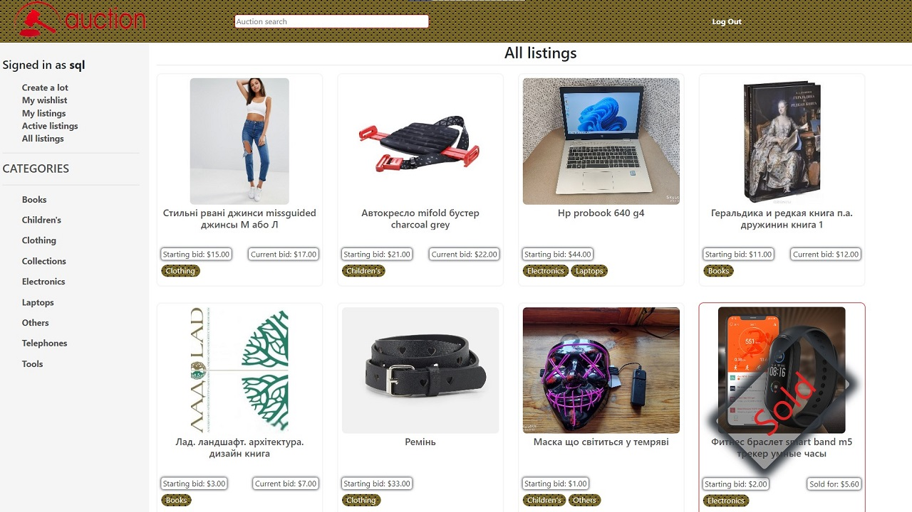

#  SQL, Models and Migrations

## Data types in SQLite

- `TEXT`: текстові рядки (наприклад, ім’я людини);
- `NUMERIC`: загальна форма числових даних (наприклад, дата чи булевий вираз);
- `INTEGER`: будь-яке ціле число (наприклад, вік людини);
- `REAL`: будь-яке дійсне число (наприклад, вага людини);
- `BLOB`: двійковий великий об’єкт (наприклад, зображення).

## Tables
- Команда створення таблиці [CREATE TABLE](https://www.w3schools.com/sql/sql_create_table.asp)  
- Можливі [оператори обмеження](https://www.tutorialspoint.com/sqlite/sqlite_constraints.htm) при створенні таблиці, наприклад `NOT NULL` або `PRIMARY KEY`  
```sql
CREATE TABLE flights(
    id INTEGER PRIMARY KEY AUTOINCREMENT,
    origin TEXT NOT NULL,
    destination TEXT NOT NULL,
    duration INTEGER NOT NULL
);
```
- Команда додавання даних до таблиці [INSERT](https://www.tutorialspoint.com/sqlite/sqlite_insert_query.htm):

```sql
INSERT INTO flights
    (origin, destination, duration)
    VALUES ("New York", "London", 415);
```

- Команда вибору даних з таблиці [SELCT](https://www.tutorialspoint.com/sqlite/sqlite_select_query.htm):  
```sql
SELECT * FROM flights;
SELECT origin, destination FROM flights;
SELECT * FROM flights WHERE id = 3;
SELECT * FROM flights WHERE origin = "New York";
SELECT * FROM flights WHERE duration > 500;
SELECT * FROM flights WHERE duration > 500 AND destination = "Paris";
SELECT * FROM flights WHERE origin IN ("New York", "Lima");
SELECT * FROM flights WHERE origin LIKE "%a%";
```

## Working with SQL in the terminal

1. Підготовка до роботи:  
- Встановлюємо [SQLite](https://www.sqlite.org/download.html)  
- Встановлюємо [браузер БД](https://sqlitebrowser.org/dl/)
2. Робота в командному рядку:  
- Створимо файл бази даних у терміналі:  
`touch flaights.sql`  
- Відкриваємо створений файл у СУБД:  
`C:\sqlite\sqlite3 flaights.sql`
3. Створюємо нову таблицю в БД:  
```sql
CREATE TABLE flights(
    id INTEGER PRIMARY KEY AUTOINCREMENT,
    origin TEXT NOT NULL,
    destination TEXT NOT NULL,
    duration INTEGER NOT NULL
);
```
- перевіряємо:  
`.tables`  

4. Додамо дані в щойно створену таблицю:
```sql
INSERT INTO flights (origin, destination, duration) VALUES ("New York", "London", 415);
INSERT INTO flights (origin, destination, duration) VALUES ("Shanghai", "Paris", 760);
INSERT INTO flights (origin, destination, duration) VALUES ("Istanbul", "Tokyo", 700);
INSERT INTO flights (origin, destination, duration) VALUES ("New York", "Paris", 435);
INSERT INTO flights (origin, destination, duration) VALUES ("Moscow", "Paris", 245);
INSERT INTO flights (origin, destination, duration) VALUES ("Lima", "New York", 455);
```
- перевіряємо:
```sql
SELECT * FROM flights;
```
- покращуємо моделювання колонок та додаємо заголовки для команди `SELECT`:  
`.mode columns`  
`.headers yes`  

5. Роблячи вибірку даних також можливо використовувати функції такі як [AVERAGE, COUNT, MAX, MIN, SUM](https://www.w3schools.com/sql/sql_count_avg_sum.asp)

## Changing the data in the table

1. Оператор 'UPDATE'  
```sql 
UPDATE flights SET duration = 430 WHERE origin = "New York" AND destination = "London";
```
2. Оператор видалення даних за певних умов `DELETE`  
```sql
DELETE FROM flights WHERE destination = "Tokyo";
```
3. Інші умови вибірки даних:  
- [LIMIT](https://www.w3schools.com/sql/sql_top.asp): обмежує кількість результатів, повернутих за запитом;
- [ORDER BY](https://www.w3schools.com/sql/sql_orderby.asp): впорядковує результати на основі вказаної колонки;
- [GROUP BY](https://www.w3schools.com/sql/sql_groupby.asp): групує результати за вказаною колонкою;
- [HAVING](https://www.w3schools.com/sql/sql_having.asp): дає змогу встановлювати додаткові обмеження за кількістю результатів.

## Joining tables JOIN request

1. Приклад синтаксису простого запиту INNER JOIN (що означає ігнорування рядків, які не мають збігів між таблицями):  
```sql
SELECT first, origin, destination
FROM flights JOIN passengers
ON passengers.flight_id = flights.id;
``` 
2. По інших видах запитів об'єднання таблиць дивіться документацію за посиланням:

- [LEFT JOIN](https://www.w3schools.com/sql/sql_join_left.asp): повертає всі рядки лівої таблиці, та тільки ті що відповідають умові з правої
- [RIGHT JOIN](https://www.w3schools.com/sql/sql_join_right.asp): протилежно попередньому запиту
- [FULL OUTER JOIN](https://www.w3schools.com/sql/sql_join_full.asp): повертає усі рядки з лівої або правої таблиць якщо вони відповідають умові

## Django models

1. `: моделі Django` — це рівень абстракції поверх SQL, що дає нам змогу працювати з базами даних, використовуючи класи та об’єкти Python, а не прямі SQL-запити.
2. Почнімо використовувати моделі, створивши джанго-проект для нашої авіакомпанії та створивши застосунок у цьому проекті.
```python  
django-admin startproject airline
cd airline
python manage.py startapp flights
```
3. Додамо `flights` до списку `INSTALLED_APPS` у `settings.py`   

4. Додамо маршрут для `flights` в `urls.py`:  
`path("flights/", include("flights.urls")),`  

5. Створіть файл `urls.py` у застосунку `flights`. І заповніть його стандартними імпортами та списками urls.py:  
```python
from django.urls import path
from . import views
urlpatterns = []
```
6. Замість створення власне шляхів і початку роботи з `views.py`, ми створимо моделі у файлі `models.py`, та опишемо які дані хочемо зберігати в нашому застосунку.  
Потім Django визначить синтаксис SQL, необхідний для зберігання інформації про кожну з наших моделей. Фактично кожна модель відповідає таблиці в якій ми будемо зберігати інформацію. Приклад таблиці (моделі) для одного рейсу:
```python
class Flight(models.Model):                         # створюємо модель, що наслідує клас моделей Django
    origin = models.CharField(max_length=64)        # поле таблиці/моделі, що відповідає пункту вильоту довжиною до 64 символів
    destination = models.CharField(max_length=64)  
    duration = models.IntegerField()
```
Про інші вбудовані типи даних полів можна прочитати [тут](https://docs.djangoproject.com/en/3.0/ref/forms/fields/#built-in-field-classes)   

## Migrations (Міграції)  

1. Не дивлячись на те, що ми створили модель у файлі `models.py`, якщо ми подивимось в каталог, то побачимо, що у нас досі немає бази даних для зберігання цієї інформації:  

  

2. Переходимо до основного каталогу нашого проекту та створюємо базу даних із наших моделей:  

`python manage.py makemigrations`  

3. Ця команда генерує певні файли Python, які створять або змінять нашу базу даних, щоб мати можливість зберігати те, що маємо в наших моделях:  

  

4. Щоб застосувати ці міграції до нашої бази даних, виконаємо команду:  

`python manage.py migrate`

5. Тепер ви побачите, що у каталозі нашого проекту з’явився файл `db.sqlite3`.

## Shell  

1. Щоб взаємодіяти з базою даних та тестувати запити можемо скористатися оболонкою, де зможемо виконувати команди Python у межах нашого проекту:  

`python manage.py shell`   

2. Далі виконуємо наступні команди для отримання досвіду роботи з shell:  

```python 
# Імпортувати модель flights
In [1]: from flights.models import Flight

# Створити новий рейс
In [2]: f = Flight(origin="New York", destination="London", duration=415)

# Вставити цей рейс до нашої бази даних
In [3]: f.save()

# Зробити запит до всіх рейсів в базі даних
In [4]: Flight.objects.all()
Out[4]: <QuerySet [<Flight: Flight object (1)>]>
```

3. Таким чином ми отримали, що у нас є один рейс під назвою Flight object (1). Це зовсім не інформативно. Виправляємо відповідь у середині models.py шляхом визначення функції __str__, що надасть вказівки щодо перетворення об’єкта Flight на рядок в середині класу:  

```python 
    def __str__(self):
        return f"{self.id}: {self.origin} to {self.destination}"
``` 

4. Далі буде приведено декілька прикладів:   

```python
# Створюємо змінну з назвою flights для збереження результатів запиту
In [7]: flights = Flight.objects.all()

# Показуємо всі рейси
In [8]: flights
Out[8]: <QuerySet [<Flight: 1: New York to London>]>

# Виокремлюємо лише перший рейс
In [9]: flight = flights.first()

# Виводимо інформацію про рейс
In [10]: flight
Out[10]: <Flight: 1: New York to London>

# Показуємо id рейсу
In [11]: flight.id
Out[11]: 1

# Показуємо пункт вильоту
In [12]: flight.origin
Out[12]: 'New York'

# Показуємо пункт призначення
In [13]: flight.destination
Out[13]: 'London'

# Показуємо тривалість рейсу
In [14]: flight.duration
Out[14]: 415
```

5. Але у нас вийшла не дуже гарна модель зберігання даних. Пам'ятаючи концепцію розглянуту раніше, переробимо класи у `models.py`  

```python
class Airport(models.Model):
    code = models.CharField(max_length=3)
    city = models.CharField(max_length=64)

    def __str__(self):
        return f"{self.city} ({self.code})"

class Flight(models.Model):
    origin = models.ForeignKey(Airport, on_delete=models.CASCADE, related_name="departures")
    destination = models.ForeignKey(Airport, on_delete=models.CASCADE, related_name="arrivals")
    duration = models.IntegerField()

    def __str__(self):
        return f"{self.id}: {self.origin} to {self.destination}"
```

6. От же що ми зробили:  
- Вказали, що обидва поля `origin` і `destination` є зовнішніми ключами, тобто вони посилаються на інший об’єкт.  
- Подаючи `Airport` як наш перший аргумент, вказуємо тип об’єкта, до якого належить це поле.  
- Наступний аргумент `on_delete=models.CASCADE` надає вказівки щодо дій у разі, якщо аеропорт буде видалено. В цьому випадку ми вказуємо, що за видалення аеропорту всі пов’язані з ним рейси також повинні бути видалені. На додаток до CASCADE існує ще кілька альтернатив.  
- В `related name` ми надаємо пов’язане ім’я, яке дає нам змогу шукати всі рейси з цим аеропортом як пунктом вильоту чи призначення.  

7. Повторюємо пункти 2 та 4 попереднього розділу, щоб застосувати зміни.  Також потрібно видалити запис з БД, або сам файл БД, тому що він вже не відповідає структурі. 

8. Заповнимо нову структуру БД даними:

```python
# Імпортуємо всі моделі
In [1]: from flights.models import *

# Створюємо нові аеропорти
In [2]: jfk = Airport(code="JFK", city="New York")
In [4]: lhr = Airport(code="LHR", city="London")
In [6]: cdg = Airport(code="CDG", city="Paris")
In [9]: nrt = Airport(code="NRT", city="Tokyo")

# Зберігаємо аеропорти у базі даних
In [3]: jfk.save()
In [5]: lhr.save()
In [8]: cdg.save()
In [10]: nrt.save()

# Додаємо рейс та зберігаємо його до бази даних
f = Flight(origin=jfk, destination=lhr, duration=414)
f.save()

# Показуємо певну інформацію про рейс
In [14]: f
Out[14]: <Flight: 1: New York (JFK) to London (LHR)>
In [15]: f.origin
Out[15]: <Airport: New York (JFK)>

# Використовуємо релятивне ім’я для запиту за аеропортом призначення:
In [17]: lhr.arrivals.all()
Out[17]: <QuerySet [<Flight: 1: New York (JFK) to London (LHR)>]>

```
## Запуск застосунку
1. Зміни у файлі urls.py:
```python
urlpatterns = [
    path('', views.index, name="index"),
]
```
2. Додамо у файл views.py:
```python
from django.shortcuts import render
from .models import Flight, Airport

# Створюємо наші views.

def index(request):
    return render(request, "flights/index.html", {
        "flights": Flight.objects.all()
    })
```

3. Створюємо новий файл airline/flight/templates/flights/layout.html:

```html
<!DOCTYPE html>
<html lang="en">
    <head>
        <title>Flights</title>
    </head>
    <body>
        { % block body % }
        { % endblock % }
    </body>
</html>
```

4. Створюємо у тій же теці index.html:

```html
{ % extends "flights/layout.html" % }

{ % block body % }
    <h1>Flights:</h1>
    <ul>
        { % for flight in flights % }
            <li>Flight {{ flight.id }}: {{ flight.origin }} to {{ flight.destination }}</li>
        { % endfor % }
    </ul>
{ % endblock % }
```
5. Запустимо сервер:  
`python manage.py runserver`

6. За адресою `http://127.0.0.1:8000/flights` отримаємо наступну сторінку:  


7. Додамо трохи більше інформації до наших даних:   

```python
# імпортуємо усі моделі
In: from flights.models import *

# Використовуємо команду filter для пошуку всіх аеропортів, розміщених у Нью-Йорку 
In: Airport.objects.filter(city="New York")
Out: <QuerySet [<Airport: New York (JFK)>]>

# Використовуємо команду get для виокремлення одного аеропорту у Нью-Йорку
In: Airport.objects.get(city="New York")
Out: <Airport: New York (JFK)>

# Призначаємо аеропортам назви змінних:
In: jfk = Airport.objects.get(city="New York")
In: cdg = Airport.objects.get(city="Paris")

# Створюємо та зберігаємо новий рейс:
In: f = Flight(origin=jfk, destination=cdg, duration=435)
In: f.save()

# Перевіримо результат:
In: Flight.objects.all()  
Out: <QuerySet [<Flight: 1: New York (JFK) to London (LHR)>, <Flight: 2: New York (JFK) to Paris (CDG)>]>
```
## Django Admin 
1. Уважно вивчаємо документацію по [вбудованому адміністративному інтерфейсу](https://docs.djangoproject.com/en/4.1/ref/contrib/admin/)  
2. Реєструємо користувача-адміністратора для використання цього інструмента:  
```shell
python manage.py createsuperuser
Username: vit
Email address: vit@um.com
Password: 
Password (again): 
Superuser created successfully.  
```
3. Імпортуємо до файлу admin.py нашого застосунку описані у models.py моделі:  
`from .models import Flight, Airport`  
4. Реєструємо моделі далі по тексту того ж файлу:  

```python
admin.site.register(Flight)
admin.site.register(Airport)
```
5. Запускаємо сайт, та заходимо за адресою: `http://127.0.0.1:8000/admin`  

  

6. От же ми отримуємо розроблений раніше інтерфейс керування даними нашого застосунку:  

 

## Розбудова сайту 
1. Додамо посилання на Web-сторінку рейса при натисканні на нього, для чого створімо URL-шлях, що містить id рейсу:  

```python
urlpatterns = [
    path("", views.index, name="index"),
    path("<int:flight_id>", views.flight, name="flight")
]
```
2. В views.py створимо функцію flight, що містить ідентифікатор рейсу та показує нову html-сторінку:  

```python
def flight(request, flight_id):
    flight = Flight.objects.get(id=flight_id)       # тут замість може id= використовуватись pk= (праймари кей)
    return render(request, "flights/flight.html", {
        "flight": flight
    })
```

3. Створимо шаблон сторінки `flights/flight.html` з інформацією про рейс та посиланням для повернення на домашню сторінку:  

```html
{ % extends "flights/layout.html" % }

{ % block body % }
    <h1>Flight {{ flight.id }}</h1>
    <ul>
        <li>Origin: {{ flight.origin }}</li>
        <li>Destination: {{ flight.destination }}</li>
        <li>Duration: {{ flight.duration }} minutes</li>
    </ul>
    <a href="{ % url 'index' %  }">All Flights</a>
{ % endblock % } 
```

4. Змінимо нашу головну сторінку, додавши посилання з кожного рейсу:  

```html
<li><a href="{ % url 'flight' flight.id % }">Flight {{ flight.id }}</a>
```

5. Як результат отримуємо ось таку головну сторінку:  

  

6. Та наступну сторінку з інформацією про рейс при переході за посиланням:  

  

## Зв’язки ManyToMany або «Багато до багатьох»
1. Створимо модель «Пасажир», який може одночасно реєструватись на багатьох рейсах:  

```python
class Passenger(models.Model):
    first = models.CharField(max_length=64)
    last = models.CharField(max_length=64)
    flights = models.ManyToManyField(Flight, blank=True, related_name="passengers")
# додамо blank=True, що пасажир міг бути незареєстрованим на жоден рейс.
# related_name="passengers" - дасть нам змогу знайти всіх пасажирів певного рейсу.
    def __str__(self):
        return f"{self.first} {self.last}"
```

2. Створимо міграції та застосовуємо їх:  

```
python manage.py makemigrations
python manage.py migrate
```  
3. Реєструємо модель «Пасажир» в admin.py та додаємо кілька пасажирів:  

```python
from .models import Flight, Airport, Passenger

# Register your models here.
admin.site.register(Passenger)
```  
4. У файлі views.py додамо можливість доступу до пасажирів в файлі `views.py`    

```python
from .models import Flight, Airport, Passenger

def flight(request, flight_id):
    flight = Flight.objects.get(pk=flight_id)
    return render(request, "flights/flight.html", {
        "flight": flight,
        "passengers": flight.passengers.all()
    })
```
5. В шаблонах додаємо список пасажирів до flight.html:  

```html
<h2>Passengers:</h2>
<ul>
    { % for passenger in passengers % }
        <li> {{ passenger }} </li>
    { % empty % }
        <li>No Passengers.</li>
    { % endfor % }
</ul>
```

6. Тепер наша сторінка з інформацією про рейс виглядає так:  


7. Додамо ще одну функцію сайту - бронювання рейсу. 
- Для чого додамо маршрут бронювання в urls.py:  

```python
path("<int:flight_id>/book", views.book, name="book")
``` 
- До views.py додамо функцію бронювання, що зареєструє пасажира на рейс:  

```python
from django.http import HttpResponseRedirect
from django.urls import reverse

def book(request, flight_id):
    # Якщо запит post - додаємо новий рейс
    if request.method == "POST":
        # Отримуємо доступ до рейсів
        flight = Flight.objects.get(pk=flight_id)
        # Знаходимо id пасажира через дані з надісланої форми. Це означає, що в квадратних дужках зазначена назва поля із форми 
        passenger_id = int(request.POST["passenger"])
        # Знаходимо пасажира за id
        passenger = Passenger.objects.get(pk=passenger_id)
        # Додаємо пасажира на рейс
        passenger.flights.add(flight)
        # Перенаправляємо користувача на сторінку рейсів
        return HttpResponseRedirect(reverse("flight", args=(flight.id,)))
```
Якщо нам потрібно викликати нову сторінку, то використовуємо метод "GET", нам же потрібно змінити данні на самій сторінці та в базі даних, тому використовуємо метод "POST"  

- Передамо певний контекст до шаблону рейсу. Щоб сформувати список тільки тих хто ще не став пасажиром рейсу використаємо [фільтр Django](https://docs.djangoproject.com/en/4.0/topics/db/queries/#retrieving-specific-objects-with-filters) виключивши певні об’єкти із запиту:  

```python
def flight(request, flight_id):
    flight = Flight.objects.get(pk=flight_id)
    return render(request, "flights/flight.html", {
        "flight": flight,
        "passengers": flight.passengers.all(),
        "non_passengers": Passenger.objects.exclude(flights=flight).all()
    })
```

- Нарешті додамо в шаблонах форму до нашої HTML-сторінки рейсу, використовуючи select із полем input:  

```html
<form action="{ % url 'book' flight.id % }" method="post">
    { % csrf_token % }
    <select name="passenger" id="">
        { % for passenger in non_passengers % }
            <option value="{{ passenger.id }}">{{ passenger }}</option>
        { % endfor % }
    </select>
    <input type="submit">
</form>
```
- Як результат отримаємо наступний вигляд сторінки:  

  

## Користувачі сайту та використання інтерфейсу адміністратора 
1. Налаштуємо вбудований [застосунок адміністратора Django](https://docs.djangoproject.com/en/4.1/ref/contrib/admin/) так щоб бачити всі аспекти рейсу в інтерфейсі адміністратора. Для цього створимо новий клас у файлі `admin.py` і додамо його як аргумент, реєструючи модель Flight:  

```python
class FlightAdmin(admin.ModelAdmin):
    list_display = ("id", "origin", "destination", "duration")
# Реєструємо нашу модель.
admin.site.register(Flight, FlightAdmin) 
```


2. Зробимо аналогічні налаштування для панелі керування пасажирами:  

```python
class PassengerAdmin(admin.ModelAdmin):
    filter_horizontal = ("flights",)
# Реєструємо нашу модель.
admin.site.register(Passenger, PassengerAdmin)
```

3. Ось так зміниться меню редагування інформації про пасажира:  
Було:  
  
Стало:  
  

## Користувачі сайту. Автентифікація
1. Створимо новий застосунок `users`  
- Крок 1:  
`python manage.py startapp users`  

- Крок 2: (airline\settings.py)   
```python
INSTALLED_APPS = [
    'flights',
    'users',
# ---- cut ----
```
- Крок 3: (airline\urls.py)   
```python
urlpatterns = [
    path('admin/', admin.site.urls),
    path('flights/', include("flights.urls")),
    path('users/', include("users.urls"))
]
```

2. Напишемо наступний код у новому файлі `urls.py`:  

```python
from django.urls import path

from . import views

urlpatterns = [
    path('', views.index, name="index"),
    path("login", views.login_view, name="login"),
    path("logout", views.logout_view, name="logout")
]
```
3. За стандартом створюємо файл layout.html з шапкою сайту:  

```html
<!DOCTYPE html>
<html lang="en">
    <head>
        <title>Users</title>
    </head>
    <body>
        { % block body % }
        { % endblock % }
    </body>
</html>
```

4. Створюємо форму, де користувач зможе увійти до системи login.html, що містить форму та демонструє повідомлення, якщо таке існує.  

```html
{ % extends "users/layout.html" % }

{ % block body % }
    { % if message % }
        <div>{{ message }}</div>
    { % endif % }

    <form action="{ % url 'login' % }" method="post">
        { % csrf_token %}
        <input type="text", name="username", placeholder="Username">
        <input type="password", name="password", placeholder="Password">
        <input type="submit", value="Login">
    </form>
{ % endblock %}
```

5. Тепер у `views.py` додамо три функції:  
```python
def index(request):
    # Якщо користувач не увійшов до системи, повернутись на сторінку входу:
    if not request.user.is_authenticated:
        return HttpResponseRedirect(reverse("login"))
    return render(request, "users/user.html")

def login_view(request):
    return render(request, "users/login.html")

def logout_view(request):
    # Pass – простий спосіб сказати python, що не треба нічого робити.
    pass
```

6. Запустимо сервер та додамо користувача через інтерфейс адміністратора http://127.0.0.1:8000/admin/auth/user/  
7. Вносимо оновлення до `views.py` у частині функції `login_view` для обробки запиту POST з ім’ям користувача та паролем:

```python
# Потрібні додаткові імпорти:
from django.contrib.auth import authenticate, login, logout

def login_view(request):
    if request.method == "POST":
        # Отримуємо доступ до ім’я користувача та пароля з даних
        username = request.POST["username"]
        password = request.POST["password"]

        # Перевіряємо, чи ім’я користувача та пароль правильні, повертаємо об’єкт User, якщо все правильно
        user = authenticate(request, username=username, password=password)

        # Якщо об’єкт user повернуто, увійти до системи та повернутись на головну сторінку:
        if user:
            login(request, user)
            return HttpResponseRedirect(reverse("index"))
        # У іншому випадку, повернутись до сторінки входу з новим контекстом
        else:
            return render(request, "users/login.html", {
                "message": "Invalid Credentials"
            })
    return render(request, "users/login.html")
```
8. Створимо файл `user.html`, який функція `index` виводить під час автентифікації користувача:
```html
{ % extends "users/layout.html" % }

{ % block body % }
    <h1>Welcome, {{ request.user.first_name }}</h1>
    <ul>
        <li>Username: {{ request.user.username }}</li>
        <li>Email: {{ request.user.email }}</li>
    </ul>

    <a href="{ % url 'logout' % }">Log Out</a>
{ % endblock % }
```
9. Оновимо функцію `logout_view`, щоб вона використовувала вбудовану у Django функцію `logout`:  
```python
def logout_view(request):
    logout(request)
    return render(request, "users/login.html", {
                "message": "Logged Out"
            })

```
10. За посиланням отримуємо наступну сторінку:  

  

## [Виконане завдання до розділу](https://github.com/vit-um/vit-um.github.io/tree/master/sql/commerce)  
Спроектуйте подібний до eBay онлайн-майданчик для електронної торгівлі та проведення аукціонів, на якому користувачі зможуть виставляти товари, розміщувати ставки та додавати товари до списку відстеження.  

Результат виконання завдання на відео нижче. В разі потреби перевірити працездатність сайту - є можливість розгорнути наведений тут код на локальному комп'ютері.  
[](https://youtu.be/GUTyulpQsBk)  

При виконанні завдання багато ідей було запозичено у [@Kviten4](https://github.com/Kviten4/auctions).
