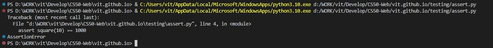
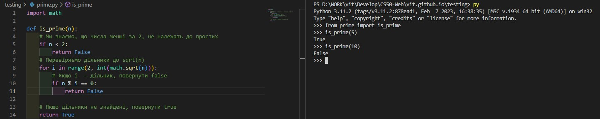

# Тестування та CI/CD

## Assert
Команда `Assert` дозволяє запустити прості тести на Python. Отже використаємо цю команду для тестування функції `square` в [наступному прикладі](assert.py) Нижче два результати виконання команди коли вираз вірний, та коли він хибний  

  

## Розробка через тестування  
Це стиль розробки програмного забезпечення, за яким під час кожного виправлення багу ви додаєте тест, який перевіряє цей баг, до зростаючого набору тестів, які запускаються щоразу, коли ви вносите зміни. 

Розберемо цей метод розробки на прикладі функції [is_prime](prime.py), яка повертає значення `True` тоді, коли її аргумент є простим числом. Спочатку подивимось як вона працює в консолі python:  



Далі вбудуємо нашу тестуючу програму в [інший код](test.py), який слід перевірити.

От же можемо почати її тестування через консоль вводячи всі можливі вірні значення на кшталт `test_prime(5, True)` або `test_prime(10, False)`. В разі якщо перевірка не пройшла, то ми отримаємо помилку на кшталт `ERROR on is_prime(25), expected False`

Враховуючи дуже велику кількість ручних операцій для тестування, зазвичай такі тести описують за допомогою скриптів. Напишемо приклад [скрипта](test.sh) для тестування нашої програми. Після запуску його в консолі командою `./test.sh` отримаємо наступний результат:  
```
$ ./test.sh
ERROR on is_prime(8), expected False
ERROR on is_prime(25), expected False
```
от же ми очікували, що число 8 не буде простим, але програма чомусь вважає інакше тоб-то має помилку.

## Модульне тестування

Щоб не писати такі тести щоразу вручну, можна наприклад використати бібліотеку Python `unittest` 

Подивімось, який вигляд [програма тестування](test_unit.py) має для нашої функції `is_prime`, написавши її виключно на Python.

Зверніть увагу, що рядок кожної функції містить припущення у формі `self.assertSOMETHING`:
- assertTrue, 
- assertFalse, 
- assertEqual,
- assertGreater
Ці та інші припущення можна знайти, переглянувши [документацію](https://docs.python.org/3/library/unittest.html#unittest.TestCase.assertEqual).

Після запуску отримуємо ті ж самі помилки що при тестуванні за допомогою скрипта:  


## Тестування Django

Для застосунків Django існує бібліотеки `TestCase` для автоматизованого тестування керування яким відбувається з файлу [tests.py](airline\flights\tests.py) проекту. Для прикладів застосування  розглянемо проект `flights`, що був написаний нами раніше та прокоментуємо його код для розуміння принципів роботи. Умови що будуть перевірятись наступні:  
- Пункт прильоту не має бути тим самим, що пункт призначення
- Тривалість рейсу має бути більшої а ніж 0 хвилин

Щоб не пошкодити данні застосунку бібліотека `TestCase` використовує окрему тестову базу даних. От же опишемо в файлі [models.py](airline\flights\models.py) функцію перевірки згаданих умов:

```python
    def is_valid_flight(self):
        return self.origin != self.destination or self.duration > 0
```
В файлі [tests.py](airline\flights\tests.py) створимо новий клас, який наслідує щойно імпортований клас TestCase. Усередині цього класу визначимо функцію setUp, яка буде запущена на початку процесу тестування та буде містити записи бази даних для тестування:  
```python
class FlightTestCase(TestCase):

    def setUp(self):

        # Створити аеропорти.
        a1 = Airport.objects.create(code="AAA", city="City A")
        a2 = Airport.objects.create(code="BBB", city="City B")

        # Створити рейси.
        Flight.objects.create(origin=a1, destination=a2, duration=100)
        Flight.objects.create(origin=a1, destination=a1, duration=200)
        Flight.objects.create(origin=a1, destination=a2, duration=-100)
```
Маючи тестові записи в БД, додамо до цього класу функції, необхідні для тестування:  

* Переконаймось, що поля departures (вильотів) й arrivals (прибуття) працюють правильно, спробувавши підрахувати кількість вильотів та прильотів з аеропорту AAA. Згідно наших записів в БД їх має бути 3 та 1 відповідно:
```python
def test_departures_count(self):
    a = Airport.objects.get(code="AAA")
    self.assertEqual(a.departures.count(), 3)

def test_arrivals_count(self):
    a = Airport.objects.get(code="AAA")
    self.assertEqual(a.arrivals.count(), 1)
```
* Запустимо тест командою `python manage.py test`, що переконатись що перевірка пройшла успішно. Нижче результат тестування, та підтвердження, що оби два тести пройдені без помилок.  


* Додамо перевірку функції `is_valid_flight`, яку ми додали до моделі Flight. Почнемо з твердження, що функція повертає `True`, коли політ дійсний:

```python
def test_valid_flight(self):
    a1 = Airport.objects.get(code="AAA")
    a2 = Airport.objects.get(code="BBB")
    f = Flight.objects.get(origin=a1, destination=a2, duration=100)
    self.assertTrue(f.is_valid_flight())
```
* Далі переконаймось, що рейси з недійсними пунктами призначення й тривалостями повертають `False`:  

```python
def test_invalid_flight_destination(self):
    a1 = Airport.objects.get(code="AAA")
    f = Flight.objects.get(origin=a1, destination=a1)
    self.assertFalse(f.is_valid_flight())

def test_invalid_flight_duration(self):
    a1 = Airport.objects.get(code="AAA")
    a2 = Airport.objects.get(code="BBB")
    f = Flight.objects.get(origin=a1, destination=a2, duration=-100)
    self.assertFalse(f.is_valid_flight())
```
* Знов запускаємо тест та бачимо, що він провалений:


* Маємо випадки, коли `is_valid_flight` повертає `True`, а мала повернути `False`. Розібравши помилки з'ясуємо, що ми зробили помилку, використавши `or` замість `and`, а це означає, що лише одна з вимог до польоту має бути дотримана, щоб політ був дійсним. Виправимо помилку наступним чином:  

```python
def is_valid_flight(self):
    return self.origin != self.destination and self.duration > 0
```

* Після запуску тесту переконаємось, що помилок немає.  

## Тестування в Django на боці користувача
* Для вебзастосунків є можливість автоматизованої перевірки певних функцій, наприклад чи продовжують після змін завантажуватись певні сторінки сайту. 
* Імпортуємо об'єкт `Client`:  
```python
from django.test import Client
```
* Тепер у файлі [tests.py](airline\flights\tests.py) додамо тест, який перевірить отримання коду відповіді `HTTP 200` та що всі три наші рейси додаються до контексту відповіді:  

```python
def test_index(self):

    # Налаштувати client для надсилання запитів
    c = Client()

    # Надіслати запит до сторінки index та зберегти відповідь
    response = c.get("/flights/")

    # Переконатись, що код статусу 200
    self.assertEqual(response.status_code, 200)

    # Переконатись, що три рейси повертаються у контексті відповіді 
    self.assertEqual(response.context["flights"].count(), 3)
```
* Щоб використати функцію `Max`, яка повертає максимальний id, до якого маємо доступ, додамо 

```python
from django.db.models import Max 
```

* Переконатись, що отримуємо код відповіді 200 для дійсної сторінки рейсу та код відповіді 404 для сторінки рейсу, яка не існує. 

```python
    def test_valid_flight_page(self):
        a1 = Airport.objects.get(code="AAA")
        f = Flight.objects.get(origin=a1, destination=a1)

        c = Client()
        response = c.get(f"/flights/{f.id}")
        self.assertEqual(response.status_code, 200)

    def test_invalid_flight_page(self):
        max_id = Flight.objects.all().aggregate(Max("id"))["id__max"]

        c = Client()
        response = c.get(f"/flights/{max_id + 1}")
        self.assertEqual(response.status_code, 404)
```
* Перевіримо, що списки пасажирів і не пасажирів згенеровані як слід:

```python
def test_flight_page_passengers(self):
    f = Flight.objects.get(pk=1)
    p = Passenger.objects.create(first="Еліс", last="Адамс")
    f.passengers.add(p)

    c = Client()
    response = c.get(f"/flights/{f.id}")
    self.assertEqual(response.status_code, 200)
    self.assertEqual(response.context["passengers"].count(), 1)

def test_flight_page_non_passengers(self):
    f = Flight.objects.get(pk=1)
    p = Passenger.objects.create(first="Еліс", last="Адамс")

    c = Client()
    response = c.get(f"/flights/{f.id}")
    self.assertEqual(response.status_code, 200)
    self.assertEqual(response.context["non_passengers"].count(), 1)
```
* Запустимо python manage.py test та переконаємось, що всі 10 тестів пройдені успішно.  