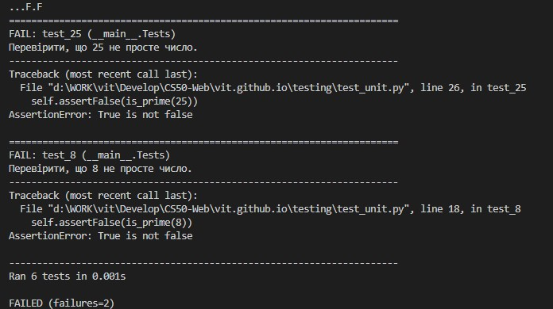

# Тестування та CI/CD

## Assert
Команда `Assert` дозволяє запустити прості тести на Python. Отже використаємо цю команду для тестування функції `square` в [наступному прикладі](assert.py) Нижче два результати виконання команди коли вираз вірний, та коли він хибний  

  

## Розробка через тестування  
Це стиль розробки програмного забезпечення, за яким під час кожного виправлення багу ви додаєте тест, який перевіряє цей баг, до зростаючого набору тестів, які запускаються щоразу, коли ви вносите зміни. 

Розберемо цей метод розробки на прикладі функції [is_prime](prime.py), яка повертає значення `True` тоді, коли її аргумент є простим числом. Спочатку подивимось як вона працює в консолі python:  


Далі вбудуємо нашу тестуючу програму в [інший код](test.py), який слід перевірити.

От же можемо почати її тестування через консоль вводячи всі можливі вірні значення на кшталт `test_prime(5, True)` або `test_prime(10, False)`. В разі якщо перевірка не пройшла, то ми отримаємо помилку на кшталт `ERROR on is_prime(25), expected False`

Враховуючи дуже велику кількість ручних операцій для тестування, зазвичай такі тести описують за допомогою скриптів. Напишемо приклад [скрипта](test.sh) для тестування нашої програми. Після запуску його в консолі командою `./test.sh` отримаємо наступний результат:  
```
$ ./test.sh
ERROR on is_prime(8), expected False
ERROR on is_prime(25), expected False
```
от же ми очікували, що число 8 не буде простим, але програма чомусь вважає інакше тоб-то має помилку.

## Модульне тестування

Щоб не писати такі тести щоразу вручну, можна наприклад використати бібліотеку Python `unittest` 

Подивімось, який вигляд [програма тестування](test_unit.py) має для нашої функції `is_prime`, написавши її виключно на Python.

Зверніть увагу, що рядок кожної функції містить припущення у формі `self.assertSOMETHING`:
- assertTrue, 
- assertFalse, 
- assertEqual,
- assertGreater
Ці та інші припущення можна знайти, переглянувши [документацію](https://docs.python.org/3/library/unittest.html#unittest.TestCase.assertEqual).

Після запуску отримуємо ті ж самі помилки що при тестуванні за допомогою скрипта:  



## Тестування Django

Для застосунків Django існує бібліотеки `TestCase` для автоматизованого тестування керування яким відбувається з файлу [tests.py](airline\flights\tests.py) проекту. Для прикладів застосування  розглянемо проект `flights`, що був написаний нами раніше та прокоментуємо його код для розуміння принципів роботи. Умови що будуть перевірятись наступні:  
1. Пункт прильоту не має бути тим самим, що пункт призначення
2. Тривалість рейсу має бути більшої а ніж 0 хвилин

Щоб не пошкодити данні застосунку бібліотека `TestCase` створю для нас окрему тестову базу даних. 