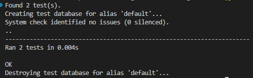
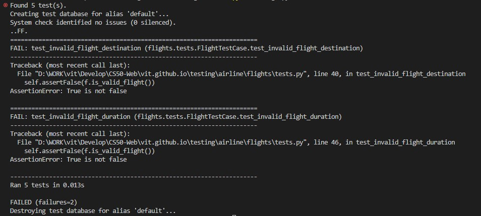
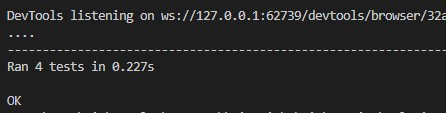
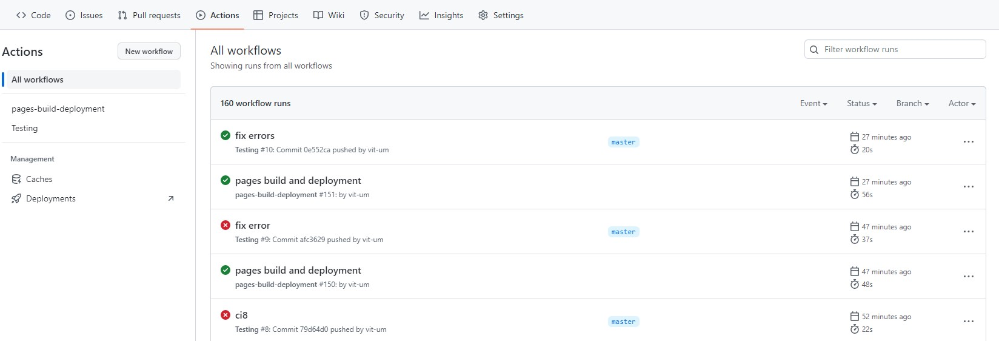
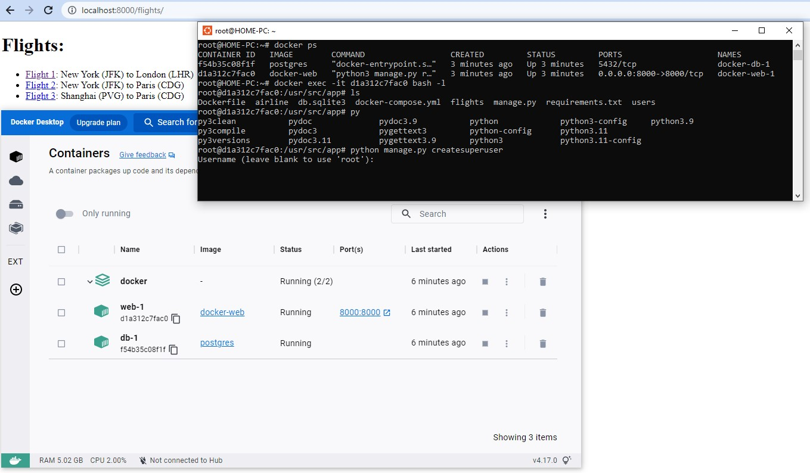

# Тестування

## Assert
Команда `Assert` дозволяє запустити прості тести на Python. Отже використаємо цю команду для тестування функції `square` в [наступному прикладі](assert.py) Нижче два результати виконання команди коли вираз вірний, та коли він хибний  

  

## Розробка через тестування  
Це стиль розробки програмного забезпечення, за яким під час кожного виправлення багу ви додаєте тест, який перевіряє цей баг, до зростаючого набору тестів, які запускаються щоразу, коли ви вносите зміни. 

Розберемо цей метод розробки на прикладі функції [is_prime](prime.py), яка повертає значення `True` тоді, коли її аргумент є простим числом. Спочатку подивимось як вона працює в консолі python:  


Далі вбудуємо нашу тестуючу програму в [інший код](test.py), який слід перевірити.

От же можемо почати її тестування через консоль вводячи всі можливі вірні значення на кшталт `test_prime(5, True)` або `test_prime(10, False)`. В разі якщо перевірка не пройшла, то ми отримаємо помилку на кшталт `ERROR on is_prime(25), expected False`

Враховуючи дуже велику кількість ручних операцій для тестування, зазвичай такі тести описують за допомогою скриптів. Напишемо приклад [скрипта](test.sh) для тестування нашої програми. Після запуску його в консолі командою `./test.sh` отримаємо наступний результат:  
```
$ ./test.sh
ERROR on is_prime(8), expected False
ERROR on is_prime(25), expected False
```
от же ми очікували, що число 8 не буде простим, але програма чомусь вважає інакше тоб-то має помилку.

## Модульне тестування

Щоб не писати такі тести щоразу вручну, можна наприклад використати бібліотеку Python `unittest` 

Подивімось, який вигляд [програма тестування](test_unit.py) має для нашої функції `is_prime`, написавши її виключно на Python.

Зверніть увагу, що рядок кожної функції містить припущення у формі `self.assertSOMETHING`:
- assertTrue, 
- assertFalse, 
- assertEqual,
- assertGreater
Ці та інші припущення можна знайти, переглянувши [документацію](https://docs.python.org/3/library/unittest.html#unittest.TestCase.assertEqual).

Після запуску отримуємо ті ж самі помилки що при тестуванні за допомогою скрипта:  


## Тестування Django

Для застосунків Django існує бібліотеки `TestCase` для автоматизованого тестування керування яким відбувається з файлу [tests.py](airline\flights\tests.py) проекту. Для прикладів застосування  розглянемо проект `flights`, що був написаний нами раніше та прокоментуємо його код для розуміння принципів роботи. Умови що будуть перевірятись наступні:  
- Пункт прильоту не має бути тим самим, що пункт призначення
- Тривалість рейсу має бути більшої а ніж 0 хвилин

Щоб не пошкодити данні застосунку бібліотека `TestCase` використовує окрему тестову базу даних. От же опишемо в файлі [models.py](airline\flights\models.py) функцію перевірки згаданих умов:

```python
    def is_valid_flight(self):
        return self.origin != self.destination or self.duration > 0
```
В файлі [tests.py](airline\flights\tests.py) створимо новий клас, який наслідує щойно імпортований клас TestCase. Усередині цього класу визначимо функцію setUp, яка буде запущена на початку процесу тестування та буде містити записи бази даних для тестування:  
```python
class FlightTestCase(TestCase):

    def setUp(self):

        # Створити аеропорти.
        a1 = Airport.objects.create(code="AAA", city="City A")
        a2 = Airport.objects.create(code="BBB", city="City B")

        # Створити рейси.
        Flight.objects.create(origin=a1, destination=a2, duration=100)
        Flight.objects.create(origin=a1, destination=a1, duration=200)
        Flight.objects.create(origin=a1, destination=a2, duration=-100)
```
Маючи тестові записи в БД, додамо до цього класу функції, необхідні для тестування:  

* Переконаймось, що поля departures (вильотів) й arrivals (прибуття) працюють правильно, спробувавши підрахувати кількість вильотів та прильотів з аеропорту AAA. Згідно наших записів в БД їх має бути 3 та 1 відповідно:
```python
def test_departures_count(self):
    a = Airport.objects.get(code="AAA")
    self.assertEqual(a.departures.count(), 3)

def test_arrivals_count(self):
    a = Airport.objects.get(code="AAA")
    self.assertEqual(a.arrivals.count(), 1)
```
* Запустимо тест командою `python manage.py test`, що переконатись що перевірка пройшла успішно. Нижче результат тестування, та підтвердження, що оби два тести пройдені без помилок.  



* Додамо перевірку функції `is_valid_flight`, яку ми додали до моделі Flight. Почнемо з твердження, що функція повертає `True`, коли політ дійсний:

```python
def test_valid_flight(self):
    a1 = Airport.objects.get(code="AAA")
    a2 = Airport.objects.get(code="BBB")
    f = Flight.objects.get(origin=a1, destination=a2, duration=100)
    self.assertTrue(f.is_valid_flight())
```
* Далі переконаймось, що рейси з недійсними пунктами призначення й тривалостями повертають `False`:  

```python
def test_invalid_flight_destination(self):
    a1 = Airport.objects.get(code="AAA")
    f = Flight.objects.get(origin=a1, destination=a1)
    self.assertFalse(f.is_valid_flight())

def test_invalid_flight_duration(self):
    a1 = Airport.objects.get(code="AAA")
    a2 = Airport.objects.get(code="BBB")
    f = Flight.objects.get(origin=a1, destination=a2, duration=-100)
    self.assertFalse(f.is_valid_flight())
```
* Знов запускаємо тест та бачимо, що він провалений:



* Маємо випадки, коли `is_valid_flight` повертає `True`, а мала повернути `False`. Розібравши помилки з'ясуємо, що ми зробили помилку, використавши `or` замість `and`, а це означає, що лише одна з вимог до польоту має бути дотримана, щоб політ був дійсним. Виправимо помилку наступним чином:  

```python
def is_valid_flight(self):
    return self.origin != self.destination and self.duration > 0
```

* Після запуску тесту переконаємось, що помилок немає.  

## Тестування в Django на боці користувача
* Для вебзастосунків є можливість автоматизованої перевірки певних функцій, наприклад чи продовжують після змін завантажуватись певні сторінки сайту. 
* Імпортуємо об'єкт `Client`:  
```python
from django.test import Client
```
* Тепер у файлі [tests.py](airline\flights\tests.py) додамо тест, який перевірить отримання коду відповіді `HTTP 200` та що всі три наші рейси додаються до контексту відповіді:  

```python
def test_index(self):

    # Налаштувати client для надсилання запитів
    c = Client()

    # Надіслати запит до сторінки index та зберегти відповідь
    response = c.get("/flights/")

    # Переконатись, що код статусу 200
    self.assertEqual(response.status_code, 200)

    # Переконатись, що три рейси повертаються у контексті відповіді 
    self.assertEqual(response.context["flights"].count(), 3)
```
* Щоб використати функцію `Max`, яка повертає максимальний id, до якого маємо доступ, додамо 

```python
from django.db.models import Max 
```

* Переконатись, що отримуємо код відповіді 200 для дійсної сторінки рейсу та код відповіді 404 для сторінки рейсу, яка не існує. 

```python
    def test_valid_flight_page(self):
        a1 = Airport.objects.get(code="AAA")
        f = Flight.objects.get(origin=a1, destination=a1)

        c = Client()
        response = c.get(f"/flights/{f.id}")
        self.assertEqual(response.status_code, 200)

    def test_invalid_flight_page(self):
        max_id = Flight.objects.all().aggregate(Max("id"))["id__max"]

        c = Client()
        response = c.get(f"/flights/{max_id + 1}")
        self.assertEqual(response.status_code, 404)
```
* Перевіримо, що списки пасажирів і не пасажирів згенеровані як слід:

```python
def test_flight_page_passengers(self):
    f = Flight.objects.get(pk=1)
    p = Passenger.objects.create(first="Еліс", last="Адамс")
    f.passengers.add(p)

    c = Client()
    response = c.get(f"/flights/{f.id}")
    self.assertEqual(response.status_code, 200)
    self.assertEqual(response.context["passengers"].count(), 1)

def test_flight_page_non_passengers(self):
    f = Flight.objects.get(pk=1)
    p = Passenger.objects.create(first="Еліс", last="Адамс")

    c = Client()
    response = c.get(f"/flights/{f.id}")
    self.assertEqual(response.status_code, 200)
    self.assertEqual(response.context["non_passengers"].count(), 1)
```
* Запустимо python manage.py test та переконаємось, що всі 10 тестів пройдені успішно.  

## Selenium - засіб для тестування веб-сторінок на стороні клієнту.  

- Розглянемо засіб тестування вебсторінки з боку клієнтського інтерфейсу. Напишемо код сторінки лічильника [counter.html](counter.html) і попрацюймо над написанням тестів для неї.

- Для автоматизованого тестування будемо використовувати інструмент `Web Driver` з фреймворку [Selenium](https://www.selenium.dev/documentation/overview/)

- В [тестовому файлі на Python](counter.py) ми можемо використати відразу два модулі, що потребують попереднього встановлення:   
    * Selenium - встановлюється командою `pip install selenium`  
    * ChromeDriver — запустивши `pip install chromedriver-py` та `pip install webdriver-manager`
    * Для OS Windows тут завантажимо [ChromeDriver](https://chromedriver.chromium.org/downloads) необхідної версії та розпакуємо його в поточний каталог та запустимо в окремому вікні терміналу

- Після встановлення бібліотек та запуску `./chromedriver.exe` спробуємо взаємодіяти з нашою сторінкою через консоль:

```python

>>> import os
>>> import pathlib
>>> import unittest
>>> from selenium import webdriver
>>> from selenium.webdriver.common.by import By

# Знайти URI для щойноствореного файлу
>>> uri = pathlib.Path(os.path.abspath("counter.html")).as_uri()

# Налаштовує веб-драйвер на використання Google chrome
>>> driver = webdriver.Chrome()

'DevTools listening on ws://127.0.0.1:62296/devtools/browser/459w6352-0241-4254-9sa8-df1557fd7f06'

# Використати URI для відкриття вебсторінки
>>> driver.get(uri)

# Отримати доступ до заголовка поточної сторінки
>>> driver.title
'Обрахунок'

# Отримати доступ до основного коду сторінки
>>> driver.page_source

'<html lang="en"><head>\n        <title>Обрахунок</title>\n        <script>\n            \n            // Зачекати завантаження сторінки\n            document.addEventListener(\'DOMContentLoaded\', () => {\n\n // Ініціалізувати змінну нулем\n                let counter = 0;\n\n                // Якщо кнопка збільшення натиснута, збільшити лічильник та змінити внутрішній html\n                document.querySelector(\'#increase\').onclick = () => {\n                    counter ++;\n                    document.querySelector(\'h1\').innerHTML = counter;\n                }\n\n                // Якщо кнопка зменшення натиснута, зменшити лічильник та змінити внутрішній html\n                document.querySelector(\'#decrease\').onclick = () => {\n                    counter --;\n                    document.querySelector(\'h1\').innerHTML = counter;\n    }\n            })\n        </script>\n    </head>\n    <body>\n        <h1>0</h1>\n        <button id="increase">+</button>\n        <button id="decrease">-</button>\n    \n</body></html>'

# Знайти та зберегти кнопки збільшення та зменшення:
>>> increase = driver.find_element(By.ID, "increase")
>>> decrease = driver.find_element(By.ID, "decrease")

# Симулювати натискання користувачем двох кнопок:
>>> increase.click()
>>> increase.click()
>>> decrease.click()

# Ми навіть можемо додавати кліки всередину інших конструкцій Python:
>>> for i in range(25):
...     increase.click()

```
- В мене в системі було встановлено дві версії Python, от же довелось у VS Code встановлювати робоче середовище для якого було раніше встановлено модуль **Selenium** Для цього натисніть `Ctrl + Shift + P` для відкриття панелі команд та введіть "Python: Select Interpreter".  

- Тепер ми готові написати код [файлу на Python для автоматизованого тестування](counter.py). От же запустимо його та отримаємо позитивний результат проходження чотирьох тестів в консолі:  

  

# CI/CD (Continuous Integration/Continuous Delivery)
## CI/CD – Aбревіатури, що позначають безперервну інтеграцію та безперервне доставлення 

CI/CD це набір методик розроблення ПЗ, які визначають, як код пишеться командою людей і як цей код згодом доставляється користувачам застосунку. 
Цей метод складається з двох основних частин:
- безперервна інтеграція:
    * регулярне злиття до основної гілки певного репозиторію спілкою авторів ПЗ;
    * автоматичне модульне тестування при кожному злитті;
- безперервного доставлення:
    * короткі графіки випуску, тобто нові версії застосунку випускаються часто та тестуються на практиці користувачами

## GitHub Actions
Дозволяє запускати ряд тестів, наприклад для перевірки стилю написання коду, коректність роботи тієї частини ПЗ, над якою працював та вклав програміст.
Тести написані на мові `yaml` та запускаються відразу після завантаження коду в репозиторій github. Дані в цій мові представляються парами «ключ-значення» (як, наприклад, у об'єктах JSON або словниках Python). 

Створюємо файл [налаштувань YAML](../.github/workflows/ci.yml) (ci.yml або ci.yaml), який працює з GitHub Actions. Для цього я створю каталог .github у своєму репозиторії, а потім каталог workflows усередині нього та, нарешті, файл ci.yml у ньому. 

Короткі пояснення команд з файлу ci.yml:  
- `name: Testing` - ім'я робочого потоку  
- `on: push` - ключ on вказує на те, що тести мають виконуватись відразу як хтось завантажує код в репозиторій    
- `jobs:` - цей ключ відкриває розділ завдань, які слід виконати при завантаженні коду  
- `test_project:` - вкладений підрозділ, це довільна назва першого завдання, їх може бути багато. Кожне завдання має визначити два компоненти `runs-on` та `steps`  
- `runs-on: ubuntu-latest` - ключ визначає ОС віртуальної машини GitHub, на якій буде виконано тест  
- `steps:` - містить дії, які мають відбуватися під час виконання цього завдання.  
- `- uses: actions/checkout@v3` - це дія, що написана розробниками GitHub для тестів нашого тику  
- `- name: Run Django unit tests` - тут можемо описати назву виконаної нами дії  
- `run:` - після цього ключа вводимо команди, які слід виконати на сервері GitHub.  

Після виправлення всіх помилок в нашому коді, як виправили баг в функції `is_valid_flight` у `models.py`, що в нашому проекті `airport` перейдемо до вкладки GitHub Actions та переглянемо журнал там де все добре:  

 

## Docker
Docker – це програмне забезпечення для контейнеризації, або створення ізольованого середовища на вашому комп'ютері, яке можна стандартизувати серед багатьох співробітників, операційних систем, платформ та інших факторів. Docker на відміну від віртуальної машини з власною ОС, створює лише контейнер на наявному комп'ютері з потрібними пакетами, конфігурацією та налаштунками змінних середовища. 

1. Для використання Докеру на локальному комп'ютері встановимо наступні пакети програмного забезпечення:  

- Install WSL command:  
`wsl --install`

```  
Выполняется установка: Платформа виртуальной машины
Установка "Платформа виртуальной машины" выполнена.
Выполняется установка: Подсистема Windows для Linux
Установка "Подсистема Windows для Linux" выполнена.
Выполняется установка: Подсистема Windows для Linux
Установка "Подсистема Windows для Linux" выполнена.
Выполняется установка: Ubuntu
Установка "Ubuntu" выполнена.
Требуемая операция выполнена успешно. Чтобы сделанные изменения вступили в силу, следует перезагрузить систему.
```
- Перевіряємо чи дозволено в БІОС віртуалізація: 
`BIOS-level hardware virtualization support must be enabled in the BIOS settings.`

- Встановлюємо сам докер за [інструкцією](https://docs.docker.com/desktop/install/windows-install/)  

- docker-compose командою:  
`pip install docker-compose`  

2. Створимо файл [Dockerfile](docker\Dockerfile) в якому системі будуть надані інструкції зі створення образу `Docker`, що описує бібліотеки та двійкові файли, які ми хочемо включити до нашого контейнера. 
3. Значення команд у файлі наступне:   
- `FROM python3:` - створити образ на основі стандартного, в якому встановлено Python 3. Використання шаблонів докеру дає змогу уникнути перевизначення тих самих базових налаштувань із кожним новим образом.
- `COPY . /usr/src/app:` - копіювати все з нашого поточного каталогу (.) та зберегти до каталогу /usr/src/app у нашому новому контейнері.
- `WORKDIR /usr/src/app:` - встановити робочий каталог, в якому будуть запускатись подальші команди всередині контейнера. (Схоже на команду cd в терміналі).
- `RUN pip install -r requirements.txt:` - у файлі requirements.txt вказуємо сві необхідні пакети, яні нам слід встановити у контейнері.
- `CMD ["python3", "manage.py", "runserver", "0.0.0.0:8000"]:` - команда, яку слід виконати під час запуску контейнера.

4. Тепер, якщо ми хочемо запустити окремий сервер для нашої бази даних, можемо просто додати інший контейнер Docker і запустити їх разом, використовуючи функцію Docker Compose. Це дасть двом різним серверам можливість працювати в окремих контейнерах, але також взаємодіяти між собою. Описуємо ці налаштування в файлі [docker-compose.yml](docker\docker-compose.yml). В файлі описані наступні дві служби:  
    - `db` налаштовує наш контейнер бази даних на основі образу, уже написаного Postgres.
    - `web` налаштовує контейнер нашого сервера наступним чином:
        * `build: . ` - Використовувати Docker File у поточному каталозі.
        * `volumes: ` - Використовувати вказаний шлях всередині контейнера.
        * `ports: ` - Зв'язати порт 8000 у контейнері з портом 8000 на нашому комп'ютері.

5. Запустимо обидва наші сервери в нових контейнерах Docker командою:  
`docker-compose up`  

6. Переглянути всі запущені в Docker контейнери можемо скориставшись командою:  
`docker ps`  

7. Тепер визначимо `CONTAINER ID` до якого ми хочемо увійти.

8. Заходимо в позначений у команді контейнер, відразу в робочий каталог `usr/src/app`, що був вибраний налаштунками, командою:  
`docker exec -it CONTAINER_ID bash -l`  

9. Можемо виконати будь-які команди всередині цього контейнера, а потім вийти, натиснувши `CTRL-D`.

10. Отже перебуваючи в контейнері нашого веб-застосунку створимо супер користувача, та перейдемо до веб-браузера, щоб перевірити роботу застосунку `http://localhost:8000/flights/`  



